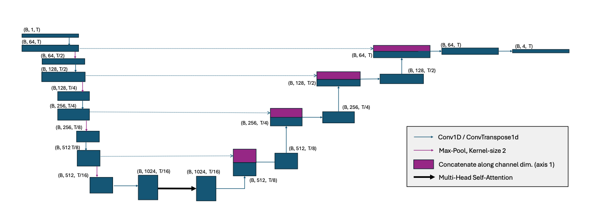
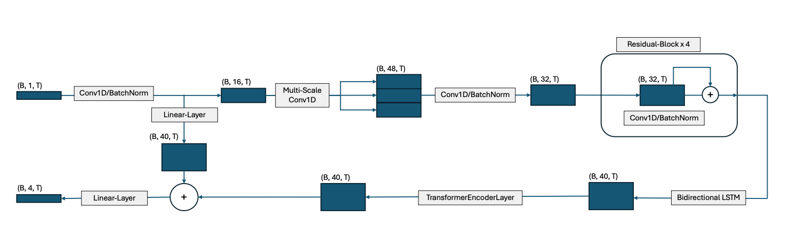

# ECG Segmentation Project Documentation

## Table of Contents

- [1. Overview](#1-overview)
  - [1.1. Key Features](#11-key-features)
- [2. Project Structure](#2-project-structure)
- [3. Installation and Setup](#3-installation-and-setup)
  - [3.1. Dependencies](#31-dependencies)
  - [3.2. Dataset: QTDB](#32-dataset-qtdb)
  - [3.3. Data Preprocessing (`preprocess_data.py`)](#33-data-preprocessing-preprocess_datapy)
    - [3.3.1. Running Preprocessing](#331-running-preprocessing)
  - [3.4. Prepared Data Format](#34-prepared-data-format)
- [4. Data Loading (`data_loader.py`)](#4-data-loading-data_loaderpy)
  - [4.1. `ECGFullDataset` Class](#41-ecgfulldataset-class)
- [5. Model Architecture (`model.py`)](#5-model-architecture-modelpy)
  - [5.1. `ECGSegmenter` Model](#51-ecgsegmenter-model)
  - [5.2. `DENS_ECG_segmenter` Model](#52-dens_ecg_segmenter-model)
  - [5.3. `FocalLoss`](#53-focalloss)
- [6. Training (`trainer.py` and `train.py`)](#6-training-trainerpy-and-trainpy)
  - [6.1. `Trainer` Class](#61-trainer-class)
  - [6.2. Training Script (`train.py`)](#62-training-script-trainpy)
- [7. Evaluation (`evaluate.py`)](#7-evaluation-evaluatepy)
- [8. Example Workflow](#8-example-workflow)
  - [8.1. Data Preprocessing](#81-data-preprocessing)
  - [8.2. Training](#82-training)
  - [8.3. Evaluation](#83-evaluation)
- [9. Training Process and Results](#9-training-process-and-results)
  - [9.1. General Training Setup](#91-general-training-setup)
  - [9.2. Model Configurations and Parameters](#92-model-configurations-and-parameters)
  - [9.3. DENS_ECG_segmenter Results](#93-dens_ecg_segmenter-results)
  - [9.4. ECGSegmenter (Small) Results](#94-ecgsegmenter-small-results)
  - [9.5. ECGSegmenter (XL) Results](#95-ecgsegmenter-xl-results)
- [10. Discussion and Key Considerations](#10-discussion-and-key-considerations)

## 1. Overview

The ECG Segmentation Project provides a robust Python-based framework for segmenting Electrocardiogram (ECG) signals into their core cardiac cycle components: No Wave, P-Wave, QRS Complex, and T-Wave. Built using PyTorch, this framework processes ECG data from the QT Database (QTDB) and supports advanced features such as data augmentation, multi-scale feature extraction, and comprehensive visualization tools. The primary goal is to develop deep learning models for precise ECG/MCG segmentation, enabling applications like QRS peak detection, average waveform generation, and computation of the magnetic field vector area during the T-wave to differentiate Arrhythmogenic Right Ventricular Cardiomyopathy (ARVC) from healthy cardiac conditions.
(c.f. [Magnetocardiography To Screen Adults with Arrhythmogenic Cardiomyopathy: a pilot study](https://github.com/Drizzr/Bachelorarbeit))

### 1.1. Key Features

- **Data Sources**: Utilizes the QT Database (QTDB) and the Lobachevsky University Database (LUDB) from PhysioNet, providing diverse ECG datasets for training and validation. QTDB offers 105 two-lead, 15-minute recordings at 250 Hz, while LUDB provides 200 12-lead, 10-second recordings at 500 Hz, both with detailed annotations for P, QRS, and T waves.
- **Preprocessing**: Includes a script (`create_dataset.py`) to download QTDB and LUDB, parse annotations, label segments (No Wave, P-Wave, QRS Complex, T-Wave), and split data into training and validation sets stored in `Datasets/train/` and `Datasets/val/`.
- **Data Loading**: Loads ECG data from CSV files in `Datasets/base/qtdb/processed/` and `Datasets/base/ludb/processed/`, applies bandpass filtering (implicitly via data characteristics or configurable), and augments with noise (sinusoidal, Gaussian, baseline wander) to simulate real-world conditions.
- **Data Augmentation**: Enhances model robustness through time shifting, amplitude scaling, and noise addition (sinusoidal, Gaussian, baseline wander), applied during training via the `ECGFullDataset` class.
- **Model Architectures**:
  - `Unet-1D-15M`: A large-scale 1D U-Net model with approximately 15 million parameters, designed for high-capacity ECG segmentation.
  - `Unet-1D-900k`: A lighter 1D U-Net model with approximately 900,000 parameters, optimized for efficiency.
  - `MCG-Segmentator_s`: A small-scale model tailored for magnetocardiogram (MCG) and ECG segmentation, balancing performance and computational efficiency.
  - `MCG-Segmentator_xl`: A larger-scale model for enhanced MCG and ECG segmentation, incorporating advanced feature extraction.
  - `DENS_ECG_segmenter`: Based on the DENS-ECG paper, featuring convolutional layers followed by BiLSTM layers for robust sequence modeling.
  - `ECGSegmenter`: A sophisticated model combining positional encoding, multi-scale convolutions (kernel sizes 3, 7, 15), residual blocks, BiLSTM, and Transformer-based self-attention for comprehensive feature extraction.

- **Training**: Configurable pipeline with Cosine Annealing learning rate scheduling, gradient clipping, and CSV logging of metrics (loss, accuracy, F1-score) in `trained_models/[model_name]/logs/`.
- **Evaluation and Postprocessing**: Generates detailed metrics (accuracy, F1-score, confusion matrix, classification report) and visualizations (signal plots with true/predicted labels) saved in `trained_models/[model_name]/evaluation_results/`. Postprocessing follows AAMI standards, evaluating onset/offset detection within a 150ms neighborhood, computing mean error, standard deviation, sensitivity, PPV, and F1-score.

- **Extensibility**: Modular design facilitates integration of new models in `model.py`, additional datasets in `Datasets/base/`, or custom augmentation techniques in `data_loader.py`.

## 2. Project Structure

The project is organized as follows:

```
project_root/
├── Datasets/
│   ├── base/
│   │   ├── qtdb/
│   │   │   ├── raw/                # Raw QTDB files (downloaded by 
│   │   │   └── processed/          # Processed QTDB CSV files
│   │   │   └──create_dataset.py    # preprocess QTDB data
│   │   ├── ludb/
│   │   │   ├── raw/                # Raw LUDB files (downloaded by 
│   │   │   └── processed/          # Processed LUDB CSV files
│   │   │   └──create_dataset.py    # preprocess LUDB data
│   ├── train/                      # Training CSV files (generated by 
│   └── val/                        # Validation CSV files (generated by 
│   └── create_training_data.py     # logic to create the train/val split
├── model/
│   ├── data_loader.py              # Dataset and DataLoader for ECG data
│   ├── model.py                    # Model architectures and loss functions
│   └── trainer.py                  # Training logic and logging
├── train.py                        # Main training script
├── evaluate.py                     # Evaluation script
├── trained_models/
│   ├── Unet-1D-15M/
│   │   ├── checkpoints/            # Saved model checkpoints for Unet-1D-15M
│   │   ├── logs/                   # Training metrics CSV for Unet-1D-15M
│   │   └── evaluation_results/     # Evaluation plots and metrics for Unet-1D-15M
│   ├── Unet-1D-900k/
│   │   ├── checkpoints/            # Saved model checkpoints for Unet-1D-900k
│   │   ├── logs/                   # Training metrics CSV for Unet-1D-900k
│   │   └── evaluation_results/     # Evaluation plots and metrics for Unet-1D-900k
│   ├── MCG-Segmentator_s/
│   │   ├── checkpoints/            # Saved model checkpoints for MCG-Segmentator_s
│   │   ├── logs/                   # Training metrics CSV for MCG-Segmentator_s
│   │   └── evaluation_results/     # Evaluation plots and metrics for MCG-Segmentator_s
│   ├── MCG-Segmentator_xl/
│   │   ├── checkpoints/            # Saved model checkpoints for MCG-Segmentator_xl
│   │   ├── logs/                   # Training metrics CSV for MCG-Segmentator_xl
│   │   └── evaluation_results/     # Evaluation plots and metrics for MCG-Segmentator_xl
│   ├── DENS-Model/
│   │   ├── checkpoints/            # Saved model checkpoints for DENS-Model
│   │   ├── logs/                   # Training metrics CSV for DENS-Model
│   │   └── evaluation_results/     # Evaluation plots and metrics for DENS-Model
└── requirements.txt                # Python dependencies
```

## 3. Installation and Setup

### 3.1. Dependencies

Install the required Python libraries using:

```bash
pip install -r requirements.txt
```

Required libraries include:

- torch
- numpy
- pandas
- matplotlib
- scikit-learn
- seaborn
- tqdm
- json
- csv
- logging
- wfdb

Ensure PyTorch is compatible with your hardware (CUDA for GPU support). Check PyTorch’s official site for installation instructions.

### 3.2. Dataset

The project utilizes two key datasets from PhysioNet for ECG segmentation: the **QT Database (QTDB)** and the **Lobachevsky University Database (LUDB)**. Both datasets are processed using the `create_dataset.py` script, which downloads raw data, parses annotations, and generates CSV files stored in `Datasets/base/qtdb/processed/` and `Datasets/base/ludb/processed/`, with training and validation splits in `Datasets/train/` and `Datasets/val/`. Below is a detailed description of each dataset and their roles in the project.

#### QT Database (QTDB)

The [QT Database (QTDB)](https://physionet.org/content/qtdb/1.0.0/), hosted on PhysioNet, is a widely used dataset for ECG analysis, particularly for evaluating algorithms that measure QT intervals and segment cardiac waveforms.

- **Composition**: Contains 105 two-lead ECG recordings, each approximately 15 minutes long, sampled at 250 Hz.
- **Annotations**: Includes manual annotations for the onset, peak, and end of P, QRS, T, and U waves, enabling precise segmentation tasks.
- **Characteristics**: Captures a diverse range of QRS and ST-T morphologies, making it suitable for testing model robustness across varied cardiac patterns.
- **Reference**: Laguna P, Mark RG, Goldberger AL, Moody GB. A Database for Evaluation of Algorithms for Measurement of QT and Other Waveform Intervals in the ECG. *Computers in Cardiology* 24:673-676 (1997).

#### Lobachevsky University Database (LUDB)

The [Lobachevsky University Database (LUDB)](https://physionet.org/content/ludb/1.0.1/) is a more recent open-access dataset designed for validating ECG delineation algorithms. It complements QTDB with its unique characteristics.

- **Composition**: Includes 200 unique subjects, each with 12-lead ECG recordings lasting 10 seconds, sampled at 500 Hz.
- **Annotations**: Provides comprehensive annotations for the onset and offset of P, QRS, and T waves for each lead, resulting in a higher number of annotated beats compared to QTDB.
- **Usage**: In this project, LUDB serves two purposes:
  1. **Validation**: Used alongside QTDB to evaluate the delineation performance of the segmentation models, allowing comparison with existing methods.
  2. **Training**: Leveraged as a training dataset to study model performance on various arrhythmias, benefiting from its diverse, high-resolution multi-lead signals.
- **Reference**: Kalinin A, et al. The Lobachevsky University Electrocardiography Database. *PhysioNet* (2020).

#### Dataset Comparison

The following table summarizes the key characteristics of the QTDB and LUDB datasets used in the project:

| Data Source | # Recordings | Duration      | Frequency | Leads | Boundary Annotations          |
|-------------|--------------|---------------|-----------|-------|-------------------------------|
| QTDB        | 105          | 15 minutes    | 250 Hz    | 2     | P, QRS on/offsets, T offsets  |
| LUDB        | 200          | 10 seconds    | 500 Hz    | 12    | P, QRS, T on/offsets          |


### 3.3. Data Preprocessing

The project employs three preprocessing scripts to prepare the QT Database (QTDB) and Lobachevsky University Database (LUDB) for ECG segmentation: `Datasets/base/qtdb/create_dataset.py` for QTDB, `Datasets/base/ludb/create_dataset.py` for LUDB, and `Datasets/create_training_data.py` for splitting processed data into training, validation, and test sets. These scripts, adapted from the [KardioNet repository](https://github.com/Seb-Good/kardionet), generate CSV files stored in `Datasets/base/qtdb/processed/` and `Datasets/base/ludb/processed/`, with splits in `Datasets/train/`, `Datasets/val/`, and `Datasets/test/`. Records with only QRS annotations are manually excluded for QTDB via `create_training_data.py` to ensure high-quality multi-class segmentation data.

For QTDB, most records lack T-wave onset annotations. To address this, the QTDB preprocessing script estimates T-wave onsets by inserting a gap sampled from a normal distribution (mean 100 ms, standard deviation 20 ms) between QRS offset and T-wave offset, ensuring at least 50% of the T-wave segment remains.

#### Key Operations (QTDB Preprocessing)

- **Download**: Fetches QTDB data from PhysioNet into `Datasets/base/qtdb/raw/` using `wfdb.dl_database` if not already present.
- **Parse Annotations**: Reads waveform data (`.dat`, `.hea`) and annotation files (e.g., `.q1c`, `.pu`) for each record.
- **Extract Labeled Intervals**: Identifies P-wave, QRS complex, and T-wave segments using annotation symbols (`p`, `N`, `A`, `t`). Gaps between waves are labeled as "No Wave" (`na`).
- **Labels**: Assigns integer labels: 0 (No Wave), 1 (P-Wave), 2 (QRS Complex), 3 (T-Wave).
- **Handle Gaps & Overlaps**: Uses a `gap_tolerance` parameter (1 second) to insert `break` markers for large gaps or `na` labels for smaller gaps. Overlaps are resolved by keeping non-overlapping segments.
- **T-Wave Onset Estimation**: For records missing T-wave onsets, inserts a gap (sampled from a normal distribution with mean 100 ms and 20 ms standard deviation) between QRS offset and T-wave offset, ensuring at least 50% of the T-wave segment remains.
- **Save Processed Data**: Saves per-channel CSVs in `Datasets/base/qtdb/processed/` with filenames like `<record_name>_ch<channel>.csv`.

#### Key Operations (LUDB Preprocessing)

- **Download**: Fetches LUDB data from PhysioNet into `Datasets/base/ludb/raw/` if not already present.
- **Resample**: Resamples 500 Hz signals to 250 Hz using `scipy.signal.resample` to match QTDB's sampling frequency.
- **Parse Annotations**: Reads waveform data (`.dat`, `.hea`) and per-lead annotations (e.g., `.i`, `.ii`, ..., `.v6`) for 12 leads.
- **Extract Labeled Intervals**: Identifies P-wave, QRS complex, and T-wave segments per lead, labeling gaps as "No Wave" (`na`).
- **Labels**: Uses the same integer labels as QTDB: 0 (No Wave), 1 (P-Wave), 2 (QRS Complex), 3 (T-Wave).
- **Handle Gaps & Overlaps**: Applies a `gap_tolerance` of 100 ms to insert `na` labels for small gaps or `break` markers for larger gaps. Overlaps are resolved by keeping non-overlapping segments.
- **Save Processed Data**: Saves per-lead CSVs in `Datasets/base/ludb/processed/` with filenames like `<patient_id>_<lead>.csv`.

#### Key Operations (Data Splitting)

The `Datasets/create_training_data.py` script splits processed CSV files from both datasets into training, validation, and test sets, stored in `Datasets/train/`, `Datasets/val/`, and `Datasets/test/`.

- **Filter Records**: For QTDB, manually excludes records with incomplete annotations (e.g., only QRS labeled) by specifying them in `qtdb_exclude_records` (e.g., `sel102`, `sel104`, etc.), which are moved to the test set. LUDB records are not excluded.
- **Split Data**: Randomly shuffles valid records and splits them into training (80%) and validation (20%) sets using a fixed `random_seed` (123). Excluded QTDB records are copied to `Datasets/test/`.
- **Copy Files**: Copies CSV files to the appropriate directories (`train/`, `val/`, or `test/`) based on record names, preserving channel/lead-specific files.

#### Key Components (QTDB)

- **QTDB Class**:
  - Manages downloading raw QTDB data (`wfdb.dl_database`).
  - Iterates through records, creating `Record` objects and saving processed CSVs.
- **Record Class**:
  - Loads waveforms (`wfdb.rdrecord`) and annotations (`wfdb.rdann`).
  - `_get_labels()`: Extracts P, QRS, and T-wave segments, handling annotation symbols and estimating T-wave onsets.
  - `_add_gap_labels()`: Inserts `na` labels for gaps below `gap_tolerance` or `break` markers for larger gaps.
  - `_get_intervals_df()`: Converts labeled segments into a Pandas DataFrame with columns for time, index, labels, waveforms, and interval IDs.
  - `save_csv()`: Saves per-channel CSVs to `Datasets/base/qtdb/processed/`.
- **Helper Functions**:
  - `_create_directory()`: Creates directories with `.gitignore` files.
  - `plot_waveform()`: Visualizes processed waveforms with labeled intervals, saved as PNGs.

#### Key Components (LUDB)

- **LUDBProcessor Class**:
  - Manages downloading and processing LUDB data.
  - Resamples signals from 500 Hz to 250 Hz.
  - Processes each of the 12 leads individually, handling per-lead annotations.
  - `_get_labels()`: Extracts P, QRS, and T-wave segments per lead, ensuring non-overlapping intervals.
  - `_add_gap_labels()`: Inserts `na` labels for gaps below 100 ms or `break` markers for larger gaps.
  - `_create_labels_array()`: Creates a labels array restricted to the first and last labeled indices.
  - Saves per-lead CSVs to `Datasets/base/ludb/processed/`.
- **Helper Functions**:
  - `plot_random_waveform()`: Visualizes a random processed waveform with labeled segments, displayed for inspection.

#### Key Components (Data Splitting)

- **split_files Function**:
  - Filters out specified QTDB records (e.g., `sel102`, `sel104`) to the test set.
  - Shuffles and splits valid records into training (80%) and validation (20%) sets.
  - Copies CSV files to `Datasets/train/`, `Datasets/val/`, or `Datasets/test/` using `shutil.copy2`.
- **create_directory Function**:
  - Creates directories with `.gitignore` files for `train/`, `val/`, and `test/`.

#### Running Preprocessing

1. **For QTDB**:
   ```bash
   cd Datasets/base/qtdb
   python create_dataset.py
   ```

2. **For LUDB**:
   ```bash
   cd Datasets/base/ludb
   python create_dataset.py
   ```

3. **For Data Splitting**:
   ```bash
   cd Datasets
   python create_training_data.py
   ```

Parameters like `DATA_DIR`, `random_seed`, `gap_mean_ms`, `gap_std_dev_ms`, and `min_t_wave_ratio_remaining` (QTDB) or `dataset_path` and `output_path` (LUDB) can be modified in the scripts' `__main__` block or class instantiation. The `qtdb_exclude_records` list in `create_training_data.py` can be updated to exclude additional records.

### 3.4. Prepared Data Format

After running the preprocessing scripts, the project expects ECG data in CSV format, stored in `Datasets/base/qtdb/processed/` and `Datasets/base/ludb/processed/`, with splits in `Datasets/train/`, `Datasets/val/`, and `Datasets/test/`. Each CSV file contains:

- **Columns**:
  - `time`: Time in seconds.
  - `index`: Sample index.
  - `label`: String label (`na`, `p`, `n`, `a`, `t`).
  - `train_label`: Integer label (0: No Wave, 1: P-Wave, 2: QRS, 3: T-Wave).
  - `wave_form`: ECG signal amplitude for the channel/lead.
  - `interval` (QTDB only): Interval ID for contiguous labeled segments.

- **QTDB CSV Structure** (e.g., `sel100_ch1.csv`):
  ```csv
  time,index,label,train_label,interval,wave_form
  0.0,0,na,0,0,-0.100
  0.004,1,na,0,0,-0.100
  0.220,55,p,1,0,-0.125
  ...
  ```

- **LUDB CSV Structure** (e.g., `1_i.csv`):
  ```csv
  time,index,label,train_label,wave_form
  0.0,0,na,0,-0.050
  0.004,1,na,0,-0.050
  0.220,55,p,1,-0.030
  ...
  ```

Ensure the data directory paths in `train.py` and `evaluate.py` (`--data_dir_train`, `--data_dir_val`, `--data_dir_eval`) point to `Datasets/train/` and `Datasets/val/` for training and evaluation, with `Datasets/test/` used for testing if applicable.

## 4. Data Loading (`data_loader.py`)

### 4.1. `ECGFullDataset` Class

The `ECGFullDataset` class, defined in `model/data_loader.py`, loads processed ECG data from CSV files in `Datasets/train/` or `Datasets/val/`, applies advanced data augmentation to simulate physiological noise, and prepares 1D sequences for training and evaluation of 1D CNN/RNN models. The class supports both QTDB and LUDB datasets, handling single-channel (QTDB: `ch1`, `ch2`; LUDB: `i`, `ii`, ..., `v6`) signals and their corresponding labels.

**Key Features**:

- Loads CSV files from a specified directory (e.g., `Datasets/train/` or `Datasets/val/`).
- Slices signals into overlapping sequences for model input.
- Applies data augmentation to mimic physiological noise, including baseline wander, powerline noise, Gaussian noise, amplitude scaling, and random time shifting.
- Normalizes signals to zero mean and scales to the [-1, 1] range.
- Returns sequences with shape `(1, sequence_length)` (single channel) and corresponding integer labels.

**Initialization**:

```python
from model.data_loader import ECGFullDataset

dataset = ECGFullDataset(
    data_dir="Datasets/train",
    channel_names=["wave_form"],
    label_column="train_label",
    sequence_length=500,
    overlap=125,
    sinusoidal_noise_mag=0.05,
    gaussian_noise_std=0.04,
    baseline_wander_mag=0.1,
    baseline_wander_freq_max=0.5,
    amplitude_scale_range=0.1,
    max_time_shift=5,
    augmentation_prob=1.0
)
```

**Parameters**:

| Parameter                 | Type      | Default | Description                                                                 |
|---------------------------|-----------|---------|-----------------------------------------------------------------------------|
| `data_dir`                | str       | —       | Directory containing processed CSV files (e.g., `Datasets/train/`).         |
| `channel_names`           | List[str] | ["wave_form"] | Column name for ECG signal in CSV (e.g., `wave_form` for LUDB, `ch1` for QTDB). |
| `label_column`            | str       | "train_label" | Column name for integer labels (0: No Wave, 1: P-Wave, 2: QRS, 3: T-Wave). |
| `file_extension`          | str       | ".csv"  | File extension for data files.                                              |
| `sequence_length`         | int       | 512     | Length of each input sequence (in samples).                                 |
| `overlap`                 | int       | 256     | Overlap between consecutive sequences (in samples).                         |
| `sinusoidal_noise_mag`    | float     | 0.05    | Magnitude of powerline noise (simulating 50 Hz interference).                |
| `gaussian_noise_std`      | float     | 0.04    | Standard deviation of Gaussian noise (in mV).                               |
| `baseline_wander_mag`     | float     | 0.1     | Magnitude of baseline wander noise.                                         |
| `baseline_wander_freq_max`| float     | 0.5     | Maximum frequency for baseline wander (in Hz).                              |
| `amplitude_scale_range`   | float     | 0.1     | Range for random amplitude scaling (±10% if 0.1).                           |
| `max_time_shift`          | int       | 5       | Maximum time shift in samples for random shifting.                          |
| `augmentation_prob`       | float     | 1.0     | Probability of applying each augmentation type.                             |

**Data Augmentation**:

To enhance model robustness, the `ECGFullDataset` class applies the following augmentations, designed to mimic physiological and environmental noise in ECG signals, based on techniques described in the referenced work:

- **Baseline Wander**: Simulates low-frequency drift using a sum of cosine functions:
  
  $n_{blw}(t) = \sum_{k=1}^{N} a_k \cos(2\pi t k \Delta f + \phi_k)$
  
  where $N$ is a random integer (1 to 3), $\Delta f = 0.01$ Hz, $a_k$ is sampled uniformly from $[-\text{baseline\_wander\_mag}, \text{baseline\_wander\_mag}]$, and $\phi_k$ from $[0, 2\pi)$.

- **Powerline Noise**: Simulates 50 Hz powerline interference using:
  
  $n_{pln}(t) = \sum_{k=1}^{M} a_k \cos(2\pi t k f_n + \phi_k)$
  
  where $M$ is a random integer (2 to 5), $f_n$ is a random frequency (1 to 30 Hz), $a_k$ is sampled uniformly from $[0, \text{sinusoidal\_noise\_mag}]$, and $\phi_k$ from $[0, 2\pi)$.

- **Gaussian Noise**: Adds random noise with zero mean and standard deviation `gaussian_noise_std` (default 0.04 mV).

- **Amplitude Scaling**: Resizes the signal by a factor $\exp(\alpha)$, where $\alpha$ is uniformly sampled from $[-\text{amplitude\_scale\_range}, \text{amplitude\_scale\_range}]$ (e.g., ±10% for 0.1).

- **Time Shifting**: Shifts the signal by a random number of samples (up to `max_time_shift`), padding with the first or last signal value to maintain sequence length.

Each augmentation is applied with probability `augmentation_prob` (default 1.0 during training), ensuring diverse training data to improve model generalization in noisy real-world conditions.

**Methods**:

- `_load_and_slice_all`: Loads all CSV files from `data_dir` and slices signals into sequences using `_slice_channel_sequences`.
- `_slice_channel_sequences`: Creates overlapping sequences from a single channel's data with specified `sequence_length` and `overlap`.
- `__getitem__`: Returns a processed sequence (tensor of shape `(1, sequence_length)`) and its labels (tensor of shape `(sequence_length,)`), applying augmentations and normalization.

**Output per Item**:

- **Signal**: `(1, sequence_length)` tensor, representing a single-channel ECG sequence, normalized to zero mean and [-1, 1] range.
- **Labels**: `(sequence_length,)` tensor of integer labels (0: No Wave, 1: P-Wave, 2: QRS, 3: T-Wave).

### 4.2. Testing and Visualization

The `data_loader.py` script includes a test block to verify the dataset functionality and visualize augmented signals:

```python
if __name__ == "__main__":
    dataset = ECGFullDataset(
        data_dir="Datasets/train",
        sequence_length=500,
        overlap=125,
        sinusoidal_noise_mag=0.05,
        gaussian_noise_std=0.04,
        baseline_wander_mag=0.1,
        amplitude_scale_range=0.1,
        max_time_shift=5,
        augmentation_prob=1.0
    )
    loader = DataLoader(dataset, batch_size=1, shuffle=True)
    signal, labels = next(iter(loader))
```

This block generates a plot with two subplots:
1. The processed signal with colored dots indicating ground truth labels (No Wave: silver, P-Wave: blue, QRS: red, T-Wave: green).
2. The label sequence as a step plot, showing the ground truth labels over time.

The plot helps verify that augmentations and labels are correctly applied, ensuring the dataset is ready for training.


## 5. Model Architecture (`model.py`)

This section describes the five deep learning models implemented in `model/model.py` for ECG segmentation, inspired by recent advances in deep learning-based ECG analysis. The models include two U-Net variants (Unet-1D-15M and Unet-1D-900k), two MCG-Segmentator variants (MCG-Segmentator_s and MCG-Segmentator_xl), and the DENS-Model. Each model is designed to segment ECG signals into four classes: No Wave (0), P-Wave (1), QRS Complex (2), and T-Wave (3). Below is an overview of the models, their architectures, and training details, followed by detailed descriptions of each model.

### 5.0. Model Overview

The following table summarizes the five models, their parameter counts, training configurations, and performance metrics. All models were trained on a combination of QTDB and LUDB datasets, using the `ECGFullDataset` class with augmentations (baseline wander, powerline noise, Gaussian noise, amplitude scaling, and time shifting) as described in Section 4. The loss function used is Focal Loss to address class imbalance, with training performed using the Adam optimizer and a cosine annealing learning rate schedule (initial learning rate: 0.001).


| Model Name         | # Parameters | Loss Function | Datasets Used | Total Epochs |
|--------------------|--------------|---------------|---------------|--------------|
| Unet-1D-15M        | ~15M         | Focal Loss    | QTDB, LUDB    | 100          |
| Unet-1D-900k       | ~900k        | Focal Loss    | QTDB, LUDB    | 100          |
| MCG-Segmentator_s  | ~375,692       | Cross Entropy   | QTDB          | 100          |
| MCG-Segmentator_xl | ~1,339,620         | Cross Entropy    | QTDB          | 100          |
| DENS-Model         | ~1,419,044       | Cross Entropy    | QTDB          | 100          |


### 5.1. Unet-1D-15M

**Architecture inspired by**: Joung, C., Kim, M., Paik, T., Kong, S.H., Oh, S.Y., Jeon, W.K., Jeon, J.H., Hong, J.S., Kim, W.J., Kook, W., Cha, M.J., & van Koert, O. (2023). Deep learning based ECG segmentation for delineation of diverse arrhythmias. *PLOS ONE*, 18(4), e0284791. https://doi.org/10.1371/journal.pone.0284791

The Unet-1D-15M model is a large-scale 1D U-Net with multi-head self-attention, designed for high-capacity ECG segmentation.

**Architecture**:

- **Encoder**: Three convolutional blocks (`ConvBlock1D`) with feature sizes [64, 128, 256, 512], each followed by max-pooling (stride 2).
- **Bottleneck**: A convolutional block with 256 channels, followed by multi-head self-attention (8 heads, dropout=0.4).
- **Decoder**: Three upsampling blocks (`ConvTranspose1d`) with skip connections from the encoder, reducing features back to 32.
- **Output**: A 1x1 convolution mapping to `num_classes` (4), producing per-timestep logits.

**Initialization**:

```python
from model.model import UNet1D

model = UNet1D(num_classes=4, input_channels=1, features=[64, 128, 256, 512], dropout=0.4, num_heads=8)
```

**Parameters**:

| Parameter         | Type  | Default | Description                                                  |
|-------------------|-------|---------|--------------------------------------------------------------|
| `num_classes`     | int   | 4       | Number of output classes (0-3).                              |
| `input_channels`  | int   | 1       | Number of input ECG channels.                                |
| `features`        | List[int] | [64, 128, 256, 512] | Feature sizes for encoder/decoder blocks.            |
| `dropout`         | float | 0.4     | Dropout rate in attention and convolutional layers.          |
| `num_heads`       | int   | 8       | Number of attention heads in MHSA.                           |

**Input/Output**:

- **Input**: `(batch_size, input_channels, sequence_length)`
- **Output**: `(batch_size, sequence_length, num_classes)` (logits)

**Architecture Diagram**:



### 5.2. Unet-1D-900k

**Architecture inspired by**: Joung, C., Kim, M., Paik, T., Kong, S.H., Oh, S.Y., Jeon, W.K., Jeon, J.H., Hong, J.S., Kim, W.J., Kook, W., Cha, M.J., & van Koert, O. (2023). Deep learning based ECG segmentation for delineation of diverse arrhythmias. *PLOS ONE*, 18(4), e0284791. https://doi.org/10.1371/journal.pone.0284791

The Unet-1D-900k model is a lightweight version of the U-Net, optimized for lower computational cost while maintaining performance.

**Architecture**:

- Similar to Unet-1D-15M but with reduced feature sizes [32, 64, 128] and no dropout in the attention layer.
- **Encoder**: Three convolutional blocks with smaller feature sizes.
- **Bottleneck**: A convolutional block with 128 channels, followed by multi-head self-attention (4 heads, dropout=0.0).
- **Decoder**: Three upsampling blocks with skip connections.
- **Output**: A 1x1 convolution mapping to `num_classes`.

**Initialization**:

```python
from model.model import UNet1D

model = UNet1D(num_classes=4, input_channels=1, features=[32, 64, 128], dropout=0.0, num_heads=4)
```

**Parameters**:

| Parameter         | Type  | Default | Description                                                  |
|-------------------|-------|---------|--------------------------------------------------------------|
| `num_classes`     | int   | 4       | Number of output classes (0-3).                              |
| `input_channels`  | int   | 1       | Number of input ECG channels.                                |
| `features`        | List[int] | [32, 64, 128] | Feature sizes for encoder/decoder blocks.            |
| `dropout`         | float | 0.0     | Dropout rate in attention layer (0 for efficiency).          |
| `num_heads`       | int   | 4       | Number of attention heads in MHSA.                           |

**Input/Output**:

- **Input**: `(batch_size, input_channels, sequence_length)`
- **Output**: `(batch_size, sequence_length, num_classes)` (logits)


### 5.3. MCG-Segmentator_s

The MCG-Segmentator_s is a smaller variant of the `ECGSegmenter` model, designed for efficiency in resource-constrained environments.

**Architecture**:

- **Positional Encoding**: Adds temporal context for sequences up to `max_seq_len`.
- **Initial Convolution**: Expands input to 16 channels (kernel size 7).
- **Multi-Scale Convolutions**: Kernels [3, 7, 15] for varied receptive fields.
- **Residual Blocks**: Four blocks with dilations [1, 2, 4, 8].
- **BiLSTM**: Single layer with 20 hidden units (bidirectional).
- **Transformer Encoder**: Single layer with 8 attention heads.
- **Skip Connection**: Combines early convolutional features with LSTM output.
- **Classifier**: Linear layer to `num_classes`.

**Initialization**:

```python
from model.model import ECGSegmenter

model = ECGSegmenter(num_classes=4, input_channels=1, hidden_channels=16, lstm_hidden=20, dropout_rate=0.3, max_seq_len=2000)
```

**Parameters**:

| Parameter         | Type  | Default | Description                                                  |
|-------------------|-------|---------|--------------------------------------------------------------|
| `num_classes`     | int   | 4       | Number of output classes (0-3).                              |
| `input_channels`  | int   | 1       | Number of input ECG channels.                                |
| `hidden_channels` | int   | 16      | Base number of convolutional hidden channels.                |
| `lstm_hidden`     | int   | 20      | Hidden size of BiLSTM.                                       |
| `dropout_rate`    | float | 0.3     | Dropout probability.                                         |
| `max_seq_len`     | int   | 2000    | Maximum sequence length for positional encoding.             |

**Input/Output**:

- **Input**: `(batch_size, input_channels, sequence_length)`
- **Output**: `(batch_size, sequence_length, num_classes)` (logits)

**Architecture Diagram**:



### 5.4. MCG-Segmentator_xl

The MCG-Segmentator_xl is a larger variant of the `ECGSegmenter` model, designed for enhanced performance on complex ECG patterns.

**Architecture**:

- Similar to MCG-Segmentator_s but with increased capacity: 64 hidden channels and 64 LSTM hidden units.
- **Positional Encoding**: Same as MCG-Segmentator_s.
- **Initial Convolution**: Expands to 32 channels.
- **Multi-Scale Convolutions**: Same kernel sizes [3, 7, 15].
- **Residual Blocks**: Four blocks with dilations [1, 2, 4, 8].
- **BiLSTM**: Single layer with 64 hidden units (bidirectional).
- **Transformer Encoder**: Single layer with 8 attention heads.
- **Skip Connection**: Combines early features with LSTM output.
- **Classifier**: Linear layer to `num_classes`.

**Initialization**:

```python
from model.model import ECGSegmenter

model = ECGSegmenter(num_classes=4, input_channels=1, hidden_channels=64, lstm_hidden=64, dropout_rate=0.3, max_seq_len=2000)
```

**Parameters**:

| Parameter         | Type  | Default | Description                                                  |
|-------------------|-------|---------|--------------------------------------------------------------|
| `num_classes`     | int   | 4       | Number of output classes (0-3).                              |
| `input_channels`  | int   | 1       | Number of input ECG channels.                                |
| `hidden_channels` | int   | 32      | Base number of convolutional hidden channels.                |
| `lstm_hidden`     | int   | 64      | Hidden size of BiLSTM.                                       |
| `dropout_rate`    | float | 0.3     | Dropout probability.                                         |
| `max_seq_len`     | int   | 2000    | Maximum sequence length for positional encoding.             |

**Input/Output**:

- **Input**: `(batch_size, input_channels, sequence_length)`
- **Output**: `(batch_size, sequence_length, num_classes)` (logits)


### 5.5. DENS-Model

**Based on**: Peimankar, A., & Puthusserypady, S. (2021). DENS-ECG: A deep learning approach for ECG signal delineation. *Expert Systems with Applications*, 165, 113911. https://doi.org/10.1016/j.eswa.2020.113911
**GitHub Repository**: https://github.com/RahmanPeimankar/dens-ecg-eswa-paper

The DENS-Model, inspired by the DENS-ECG paper, combines convolutional and recurrent layers for robust ECG segmentation.

**Architecture**:

- **Convolutional Layers**: Three Conv1d layers with channels [32, 64, 128] (kernel size 3, padding 1).
- **BiLSTM Layers**: Two bidirectional LSTMs with hidden sizes 250 and 125.
- **Dropout**: Applied after BiLSTM (p=0.2).
- **Classifier**: Linear layer mapping to `num_classes`, with softmax applied during inference (implicitly handled by CrossEntropyLoss during training).

**Initialization**:

```python
from model.model import DENS_ECG_segmenter

model = DENS_ECG_segmenter(input_channels=1, num_classes=4)
```

**Parameters**:

| Parameter         | Type | Default | Description                             |
|-------------------|------|---------|-----------------------------------------|
| `input_channels`  | int  | 1       | Number of input ECG channels.           |
| `num_classes`     | int  | 4       | Number of output classes (0-3).         |

**Input/Output**:

- **Input**: `(batch_size, input_channels, sequence_length)`
- **Output**: `(batch_size, sequence_length, num_classes)` (logits)


## 6. Training (`trainer.py` and `train.py`)

This section describes the training pipeline implemented in `trainer.py` and `train.py` for the ECG segmentation models (Unet-1D-15M, Unet-1D-900k, MCG-Segmentator_s, MCG-Segmentator_xl, and DENS-Model) defined in `model/model.py`. The pipeline uses the `ECGFullDataset` class to load preprocessed QTDB and LUDB data with augmentations (sinusoidal noise, Gaussian noise, baseline wander, amplitude scaling, and time shifting) and employs Focal Loss to address class imbalance. Training is performed using the Adam optimizer with a cosine annealing learning rate schedule.

### 6.1. `Trainer` Class

The `Trainer` class, defined in `trainer.py`, manages the training and validation loops, logging metrics to a CSV file and saving checkpoints.

**Initialization**:

```python
from model.trainer import Trainer

trainer = Trainer(
    model=model,
    train_loader=train_loader,
    val_loader=val_loader,
    args=args,
    optimizer=optimizer,
    device=device,
    log_filepath="MCG_segmentation/logs/training_metrics.csv",
    lr_scheduler=scheduler,
    init_epoch=1
)
```

**Key Methods**:

- `train()`: Executes the training loop over epochs, computing loss, accuracy, and updating model parameters using Focal Loss and gradient clipping.
- `validate()`: Evaluates the model on the validation set, computing loss, accuracy, and macro F1-score.
- `save_model()`: Saves model, optimizer, scheduler states, and training parameters to checkpoints.
- `_log_epoch_metrics()`: Logs epoch metrics to a CSV file.
- `focal_loss()`: Implements Focal Loss with `alpha=0.25` and `gamma=2.0`.

**Logged Metrics** (in `logs/training_metrics.csv`):

| Metric            | Description                                           |
|-------------------|-------------------------------------------------------|
| `epoch`           | Current epoch number.                                 |
| `train_loss`      | Average training loss for the epoch.                  |
| `train_acc`       | Average training accuracy for the epoch.              |
| `val_loss`        | Average validation loss for the epoch.                |
| `val_acc`         | Average validation accuracy for the epoch.            |
| `val_f1_macro`    | Macro-averaged F1-score on validation set.           |
| `learning_rate`   | Current learning rate.                               |

### 6.2. Training Script (`train.py`)

The `train.py` script parses command-line arguments, sets up datasets, models, optimizers, schedulers, and the `Trainer` class, and initiates training. It supports all five models and allows resuming from checkpoints.

**Usage Example**:

```bash
python train.py \
    --data_dir_train MCG_segmentation/Datasets/train \
    --data_dir_val MCG_segmentation/Datasets/val \
    --save_dir MCG_segmentation/checkpoints \
    --metrics_file MCG_segmentation/logs/training_metrics.csv \
    --model_name UNet1D \
    --num_epochs 50 \
    --batch_size 64 \
    --max_lr 1e-3 \
    --sequence_length 500 \
    --overlap 400 \
    --sinusoidal_noise_mag 0.04 \
    --augmentation_prob 0.80
```

**Key Arguments**:

| Argument                   | Type  | Default                              | Description                                                  |
|----------------------------|-------|--------------------------------------|--------------------------------------------------------------|
|
| `--num_epochs`             | int   | 50                                   | Number of training epochs.                                   |
| `--batch_size`             | int   | 64                                   | Training batch size.                                         |
| `--val_batch_size`         | int   | 4                                    | Validation batch size.                                       |
| `--max_lr`                 | float | 1e-3                                 | Maximum learning rate for scheduler.                         |
| `--base_lr`                | float | 1e-5                                 | Minimum learning rate for cosine annealing.                  |
| `--clip`                   | float | 1.0                                  | Gradient clipping value (0 to disable).                      |
| `--from_check_point`       | bool  | False                                | Resume training from a checkpoint.                           |
| `--load_dir`               | str   | MCG_segmentation/checkpoints         | Directory to load checkpoint from.                           |
| `--save_dir`               | str   | MCG_segmentation/checkpoints         | Directory for saving new checkpoints.                        |
| `--data_dir_train`         | str   | MCG_segmentation/Datasets/train      | Training data directory.                                     |
| `--data_dir_val`           | str   | MCG_segmentation/Datasets/val        | Validation data directory.                                   |
| `--sequence_length`        | int   | 500                                  | Input sequence length for the model.                         |
| `--overlap`                | int   | 400                                  | Overlap when creating sequences from files.                  |
| `--num_workers`            | int   | 4                                    | Number of DataLoader workers.                                |
| `--sinusoidal_noise_mag`   | float | 0.04                                 | Magnitude of sinusoidal noise for augmentation.              |
| `--gaussian_noise_std`     | float | 0.04                                 | Standard deviation of Gaussian noise for augmentation.       |
| `--baseline_wander_mag`    | float | 0.1                                  | Magnitude of baseline wander for augmentation.               |
| `--augmentation_prob`      | float | 0.80                                 | Probability of applying augmentations during training.       |
| `--metrics_file`           | str   | MCG_segmentation/logs/training_metrics.csv | Path for CSV logging of metrics.                   |
| `--print_freq`             | int   | 50                                   | Frequency of printing training stats (in steps).             |


**Checkpoints**:

- **Periodic Checkpoints**: Saved every 5 epochs in `save_dir/checkpoint_epoch_X/` with files `model.pth`, `optimizer.pth`, `lr_scheduler.pth`, and `params.json`.
- **Best Checkpoint**: Saved in `save_dir/best/` when the validation macro F1-score improves.
- **Resuming Training**: Enabled via `--from_check_point` and `--load_dir`, loading model, optimizer, scheduler states, and training parameters.

**Training Process**:

- **Optimizer**: Adam (or AdamW for new training) with initial learning rate set to `--max_lr`.
- **Learning Rate Schedule**: CosineAnnealingLR with `T_max` set to `num_epochs * len(train_loader)` steps, annealing to `--base_lr`.
- **Loss Function**: Focal Loss with `alpha=0.25` and `gamma=2.0`.
- **Datasets**: Preprocessed QTDB and LUDB datasets, split as described in Section 3.3, with augmentations applied during training (disabled for validation).
- **Progress Monitoring**: Uses `tqdm` for progress bars, printing loss, accuracy, and learning rate every `--print_freq` steps.
- **Error Handling**: Handles interruptions (e.g., KeyboardInterrupt) and errors by saving the model state before exiting.


## 7. Evaluation (`evaluate.py`)

The `evaluate.py` script evaluates a trained model on a dataset, computing metrics and generating visualizations.

**Usage Example**:

```bash
python evaluate.py \
    --load_dir project_root/checkpoints/my_model_run/best \
    --data_dir_eval project_root/qtdb/processed/val \
    --output_dir project_root/evaluation_results/my_model_run_eval \
    --sequence_length 2000 \
    --model_name ECGSegmenter \
    --ecg_segmenter_hidden_channels 16 \
    --ecg_segmenter_lstm_hidden 20 \
    --plot_sample_index 0
```

**Key Arguments**:

| Argument                   | Type  | Default (example)                             | Description                                                  |
|----------------------------|-------|-----------------------------------------------|--------------------------------------------------------------|
| `--load_dir`               | str   | Required                                      | Directory containing the model checkpoint.                   |
| `--data_dir_eval`          | str   | project_root/qodb/processed/val               | Evaluation data directory.                                   |
| `--output_dir`             | str   | project_root/evaluation_results/eval_output   | Directory for saving evaluation outputs.                     |
| `--eval_batch_size`        | int   | 1                                             | Batch size for evaluation.                                   |
| `--sequence_length`        | int   | 2000                                          | Sequence length for evaluation.                              |
| `--plot_sample_index`      | int   | None                                          | Index of a sample from the dataset to plot (optional).       |

**Outputs** (saved in `output_dir`):

- **Metrics File** (`evaluation_metrics.txt`): Contains overall evaluation loss, accuracy, and a detailed classification report.
- **Confusion Matrix** (`confusion_matrix.png`): A heatmap visualizing the confusion matrix.
- **Sample Plot** (`sample_X_plot.png`): If `--plot_sample_index` is provided, a plot showing:
  - Top panel: Original signal with true labels (dots) and predicted labels (colored background).
  - Bottom panel: True vs. predicted label sequences, highlighting mismatches.

## 8. Example Workflow

### 8.1. Data Preprocessing

Ensure `preprocess_data.py` is configured (e.g., `DATA_DIR`, split ratio).

Run the script:

```bash
python preprocess_data.py
```

This will populate `project_root/qtdb/raw/` and `project_root/qtdb/processed/`.

### 8.2. Training

(Simplified example; use `train.py` for full functionality)

```python
from model.data_loader import ECGFullDataset
from model.model import ECGSegmenter
from model.trainer import Trainer
from torch.utils.data import DataLoader
import torch
import argparse

args = argparse.Namespace(
    data_dir_train="project_root/qtdb/processed/train",
    data_dir_val="project_root/qtdb/processed/val",
    channel_names=["ch1"],
    label_column="train_label",
    sequence_length=500,
    overlap=400,
    sinusoidal_noise_mag=0.04,
    gaussian_noise_std=0.02,
    baseline_wander_mag=0.02,
    amplitude_scale_range=0.1,
    max_time_shift=5,
    augmentation_prob=0.9,
    model_name="ECGSegmenter",
    input_channels=1,
    ecg_segmenter_hidden_channels=16,
    ecg_segmenter_lstm_hidden=20,
    num_classes=4,
    num_epochs=100,
    batch_size=64,
    val_batch_size=64,
    max_lr=1e-4,
    base_lr=1e-5,
    clip=1.0,
    save_dir="project_root/checkpoints/example_run",
    metrics_file="project_root/logs/example_run_metrics.csv",
    print_freq=50,
    num_workers=4,
    from_check_point=False,
    load_dir=None
)

train_dataset = ECGFullDataset(
    data_dir=args.data_dir_train,
    channel_names=args.channel_names,
    label_column=args.label_column,
    sequence_length=args.sequence_length,
    overlap=args.overlap,
    sinusoidal_noise_mag=args.sinusoidal_noise_mag,
    gaussian_noise_std=args.gaussian_noise_std,
    baseline_wander_mag=args.baseline_wander_mag,
    amplitude_scale_range=args.amplitude_scale_range,
    max_time_shift=args.max_time_shift,
    augmentation_prob=args.augmentation_prob
)
val_dataset = ECGFullDataset(
    data_dir=args.data_dir_val,
    channel_names=args.channel_names,
    label_column=args.label_column,
    sequence_length=args.sequence_length,
    overlap=args.overlap,
    augmentation_prob=0.0
)
train_loader = DataLoader(train_dataset, batch_size=args.batch_size, shuffle=True, num_workers=args.num_workers, pin_memory=True)
val_loader = DataLoader(val_dataset, batch_size=args.val_batch_size, shuffle=False, num_workers=args.num_workers, pin_memory=True)

device = torch.device("cuda" if torch.cuda.is_available() else "cpu")
if args.model_name == "ECGSegmenter":
    model = ECGSegmenter(
        num_classes=args.num_classes,
        input_channels=args.input_channels,
        hidden_channels=args.ecg_segmenter_hidden_channels,
        lstm_hidden=args.ecg_segmenter_lstm_hidden
    ).to(device)
elif args.model_name == "DENS_ECG_segmenter":
    model = DENS_ECG_segmenter(
        num_classes=args.num_classes,
        input_channels=args.input_channels
    ).to(device)
else:
    raise ValueError(f"Unknown model: {args.model_name}")

optimizer = torch.optim.AdamW(model.parameters(), lr=args.max_lr)
lr_scheduler = torch.optim.lr_scheduler.CosineAnnealingLR(optimizer, T_max=args.num_epochs * len(train_loader), eta_min=args.base_lr)

print(f"To train, run:\npython train.py --model_name {args.model_name} --data_dir_train {args.data_dir_train} --data_dir_val {args.data_dir_val} --save_dir {args.save_dir} ...")
```

**Actual Training Command**:

See section [6.2. Training Script (`train.py`)](#62-training-script-trainpy).

### 8.3. Evaluation

(Simplified example; use `evaluate.py` for full functionality)

```python
from model.data_loader import ECGFullDataset
from model.model import DENS_ECG_segmenter
from torch.utils.data import DataLoader
import torch
import argparse

args = argparse.Namespace(
    load_dir="project_root/checkpoints/example_run/best",
    data_dir_eval="project_root/qtdb/processed/val",
    output_dir="project_root/evaluation_results/example_run_eval",
    channel_names=["ch1"],
    label_column="train_label",
    model_name="DENS_ECG_segmenter",
    input_channels=1,
    num_classes=4,
    sequence_length=2000,
    eval_batch_size=1,
    num_workers=4,
    plot_sample_index=0
)

print(f"To evaluate, run:\npython evaluate.py --load_dir {args.load_dir} --data_dir_eval {args.data_dir_eval} --output_dir {args.output_dir} ...")
```

**Actual Evaluation Command**:

See section [7. Evaluation (`evaluate.py`)](#7-evaluation-evaluatepy).

## 9. Training Process and Results

This section outlines the training methodology and summarizes the performance of different models. The primary goal was to train models capable of handling noisy ECG data.

### 9.1. General Training Setup

**Dataset Augmentation**:

- `ECGFullDataset` was used with aggressive augmentation:
  - `overlap`: As per `args.overlap` (e.g., 400 for `sequence_length` 500).
  - `sinusoidal_noise_mag`: 0.04
  - `gaussian_noise_std`: 0.02
  - `baseline_wander_mag`: 0.02
  - `augmentation_prob`: 0.90
- **Learning Rate Scheduler**: Cosine Annealing (`torch.optim.lr_scheduler.CosineAnnealingLR`).
- **Optimizer**: AdamW.
- **Signal Preprocessing**: No explicit high-pass or low-pass filtering was applied.
- **Metrics**: Focused on overall accuracy and macro F1-score.

<p align="center">
<b>Plot of the Cosine Annealing scheduler</b><br>

</p>

### 9.2. Model Configurations and Parameters

Three main model configurations were trained and evaluated:

- **DENS_ECG_segmenter**:
  - Input Channels: 1
  - Number of Parameters: ~1,419,044
- **ECGSegmenter (Small - 's')**:
  - Input Channels: 1
  - `hidden_channels`: 16
  - `lstm_hidden`: 20
  - Number of Parameters: ~375,692
- **ECGSegmenter (XL - 'xl')**:
  - Input Channels: 1
  - `hidden_channels`: 32
  - `lstm_hidden`: 64
  - Number of Parameters: ~1,339,620


Evaluation segment. Where the eval file is beeing explained along with the post processing similar to here but applied to my use case:

n order to evaluate the performance of the proposed delineation algorithm, we compare the ground truth annotations for the onsets and offsets of P, QRS, and T waves with the predicted annotations. We follow the usual standard chosen by The Association for the Advancement of Medical Instrumentation(AAMI) [47], which considers an onset or an offset to be correctly detected if an algorithm locates the same type of annotation in a neighborhood of 150ms. Using this threshold value, we examine for each predicted point whether the prediction correctly detects a point in the ground truth annotation.
If a ground truth annotation is correctly detected, we count a true positive(TP). In this case, the error is measured as the time deviation of the predicted point from the manual annotation. If there is no point of the ground truth annotation in the 150ms neighborhood of the prediction, then we count a false positive(FP). Once every prediction has been compared with the manual labels, we count for each point of the ground truth annotation which has not been related to any prediction a false negative(FN).
Based on this, we calculate the following evaluation metrics:
mean error m
standard deviation of error σ
sensitivity
𝑆⁢𝑒=
𝑇⁢𝑃
𝑇⁢𝑃+𝐹⁡𝑁
 
 
(5)
positive predictive value
𝑃⁢𝑃⁢𝑉=
𝑇⁢𝑃
𝑇⁢𝑃+𝐹⁡𝑃
 
 
(6)
F1-score
𝐹⁡1=2·
𝑆⁢𝑒·𝑃⁢𝑃⁢𝑉
𝑆⁢𝑒+𝑃⁢𝑃⁢𝑉
 
 
(7)
Se indicates the algorithm’s ability to identify true positives among all ground truth annotations, while PPV quantifies the algorithm’s precision in detecting annotations. Furthermore, the F1-score, defined as the harmonic mean of Se and PPV, offers a unified assessment of the algorithm’s performance. These metrics have been commonly used in the literature for the evaluation of ECG delineation algorithms [3, 4, 8, 40], and we use them to evaluate performance of our model.


### 9.3. DENS_ECG_segmenter Results


change the structure of the results section. Each Model should have on plot showing how the loss and accuracy evolved during training then one example plot of the segmentation.

In the end a tabular should be created that compares the performance on the onsets and offsets performance according to the Norm decsribed in the section above.

**Reference**: Peimankar, A., & Puthusserypady, S. (2020). DENS-ECG: A deep learning approach for ECG signal delineation. arXiv. [https://arxiv.org/abs/2005.08689](https://arxiv.org/abs/2005.08689)

<b>DENS_ECG_segmenter Training Metrics</b><br>
<table>
<tr>
<td align="center" valign="top">

</td>
<td align="center" valign="top">

</td>
</tr>
</table>

**Evaluation on Data without Additional DataLoader Noise** (validation set):

- **Eval Loss**: 0.8990 | **Accuracy**: 0.8423

| Class       | Precision | Recall | F1-Score | Support |
|-------------|-----------|--------|----------|---------|
| No Wave     | 0.8669    | 0.8312 | 0.8487   | 129300  |
| P Wave      | 0.7875    | 0.8151 | 0.8011   | 29456   |
| QRS         | 0.8664    | 0.8661 | 0.8663   | 29428   |
| T Wave      | 0.8075    | 0.8695 | 0.8374   | 55816   |
| **Macro Avg** | **0.8321** | **0.8455** | **0.8384** | **244000** |
| **Weighted Avg** | **0.8436** | **0.8423** | **0.8425** | **244000** |


**Evaluation on Data with Additional DataLoader Noise** (validation set, `augmentation_prob=1.0`):

- **Eval Loss**: 0.9147 | **Accuracy**: 0.8268

| Class       | Precision | Recall | F1-Score | Support |
|-------------|-----------|--------|----------|---------|
| No Wave     | 0.8484    | 0.8214 | 0.8347   | 142230  |
| P Wave      | 0.7529    | 0.7675 | 0.7601   | 32705   |
| QRS         | 0.8611    | 0.8626 | 0.8619   | 32773   |
| T Wave      | 0.8021    | 0.8515 | 0.8261   | 62292   |
| **Macro Avg** | **0.8161** | **0.8258** | **0.8207** | **270000** |
| **Weighted Avg** | **0.8277** | **0.8268** | **0.8270** | **270000** |


<b>DENS_ECG_segmente Confusion Matrix (With Noise / w/o noise)</b><br>
<table>
<tr>
<td align="center" valign="top">

</td>
<td align="center" valign="top">

</td>
</tr>
</table>


### 9.4. ECGSegmenter (Small) Results


<b>ECGSegmenter (Small) Training Metrics</b><br>
<table>
<tr>
<td align="center" valign="top">

</td>
<td align="center" valign="top">

</td>
</tr>


**Evaluation on Data without Additional DataLoader Noise** (validation set):

- **Eval Loss**: 0.3635 | **Accuracy**: 0.8477

| Class       | Precision | Recall | F1-Score | Support |
|-------------|-----------|--------|----------|---------|
| No Wave     | 0.8669    | 0.8452 | 0.8559   | 129300  |
| P Wave      | 0.8106    | 0.8071 | 0.8089   | 29456   |
| QRS         | 0.8734    | 0.8678 | 0.8706   | 29428   |
| T Wave      | 0.8125    | 0.8640 | 0.8375   | 55816   |
| **Macro Avg** | **0.8408** | **0.8460** | **0.8432** | **244000** |
| **Weighted Avg** | **0.8484** | **0.8477** | **0.8478** | **244000** |


</table>


**Evaluation on Data with Additional DataLoader Noise** (validation set, `augmentation_prob=1.0`):

- **Eval Loss**: 0.3913 | **Accuracy**: 0.8355

| Class       | Precision | Recall | F1-Score | Support |
|-------------|-----------|--------|----------|---------|
| No Wave     | 0.8592    | 0.8283 | 0.8434   | 129301  |
| P Wave      | 0.7848    | 0.7918 | 0.7883   | 29473   |
| QRS         | 0.8750    | 0.8677 | 0.8713   | 29435   |
| T Wave      | 0.7926    | 0.8583 | 0.8241   | 55791   |
| **Macro Avg** | **0.8279** | **0.8365** | **0.8318** | **244000** |
| **Weighted Avg** | **0.8369** | **0.8355** | **0.8357** | **244000** |


<b>ECGSegmenter (Small) Confusion Matrix (With Noise / w/o noise)</b><br>
<table>
<tr>
<td align="center" valign="top">

</td>
<td align="center" valign="top">

</td>
</tr>
</table>


### 9.5. ECGSegmenter (XL) Results


<b>ECGSegmenter (XL) Training Metrics</b><br>
<table>
<tr>
<td align="center" valign="top">

</td>
<td align="center" valign="top">

</td>
</tr>
</table>


**Evaluation on Data without Additional DataLoader Noise** (validation set):

- **Eval Loss**: 0.3778 | **Accuracy**: 0.8474

| Class       | Precision | Recall | F1-Score | Support |
|-------------|-----------|--------|----------|---------|
| No Wave     | 0.8653    | 0.8433 | 0.8542   | 142196  |
| P Wave      | 0.8333    | 0.7930 | 0.8127   | 32724   |
| QRS         | 0.8768    | 0.8656 | 0.8712   | 32804   |
| T Wave      | 0.8032    | 0.8756 | 0.8379   | 62276   |
| **Macro Avg** | **0.8447** | **0.8444** | **0.8440** | **270000** |
| **Weighted Avg** | **0.8485** | **0.8474** | **0.8474** | **270000** |


**Evaluation on Data with Additional DataLoader Noise** (validation set, `augmentation_prob=1.0`):

- **Eval Loss**: 0.4109 | **Accuracy**: 0.8329

| Class       | Precision | Recall | F1-Score | Support |
|-------------|-----------|--------|----------|---------|
| No Wave     | 0.8602    | 0.8192 | 0.8392   | 142180  |
| P Wave      | 0.7896    | 0.7830 | 0.7863   | 32701   |
| QRS         | 0.8642    | 0.8718 | 0.8680   | 32796   |
| T Wave      | 0.7847    | 0.8700 | 0.8252   | 62323   |
| **Macro Avg** | **0.8247** | **0.8360** | **0.8297** | **270000** |
| **Weighted Avg** | **0.8347** | **0.8329** | **0.8331** | **270000** |


<b>ECGSegmenter (XL) Confusion Matrix (With Noise / w/o noise)</b><br>
<table>
<tr>
<td align="center" valign="top">

</td>
<td align="center" valign pinc="top">

</td>
</tr>
</table>


also add a section about possible applications:

improved QRS detection
identifying heart beat signal via an heart beat score. Describe the idea:
num_channels, _ = confidence.shape
        
        mean_confidence = np.mean(confidence, axis=-1) # Shape: (num_channels,)


        # Calculate segment percentages
        segment_percentages = np.zeros((num_channels, 4))
        total_samples_per_channel = labels.shape[-1]

        if total_samples_per_channel > 0:
            for segment_type in range(4): # 0, 1, 2, 3
                segment_counts = np.sum(labels == segment_type, axis=1) # Sum over time axis
                segment_percentages[:, segment_type] = (segment_counts / total_samples_per_channel) * 100
        # Else: percentages remain zero

        # Define ideal ranges (consider making these class attributes or constants)
        p_wave_range = (8, 15)      # Relaxed P-wave: 8-15%
        qrs_range = (8, 15)         # Relaxed QRS: 8-15%
        t_wave_range = (15, 30)     # Relaxed T-wave: 15-30%

        # Calculate plausibility scores (vectorized)
        p_percent = segment_percentages[:, self.LABEL_TO_IDX["P Wave"]]
        qrs_percent = segment_percentages[:, self.LABEL_TO_IDX["QRS"]]
        t_percent = segment_percentages[:, self.LABEL_TO_IDX["T Wave"]]

        # Deviations (calculate difference from range boundaries)
        p_dev = np.maximum(0, p_wave_range[0] - p_percent) + np.maximum(0, p_percent - p_wave_range[1])
        qrs_dev = np.maximum(0, qrs_range[0] - qrs_percent) + np.maximum(0, qrs_percent - qrs_range[1])
        t_dev = np.maximum(0, t_wave_range[0] - t_percent) + np.maximum(0, t_percent - t_wave_range[1])

        total_deviation = p_dev + qrs_dev + t_dev

        # Normalize deviation - use a max possible deviation or just invert
        # Simple inversion: Higher score for lower deviation. Add epsilon for stability.
        # Scale factor can be adjusted based on expected deviation range.
        plausibility_scores = 1.0 / (1.0 + total_deviation * 0.1) # Smaller multiplier = less sensitive

        # Combine scores
        # Normalize confidence to avoid scale issues if confidence varies widely

        final_scores = (confidence_weight * mean_confidence) + (plausibility_weight * plausibility_scores)

        if zero_input_mask is not None:
            final_scores[zero_input_mask] = 0.0

        return final_scores, mean_confidence, segment_percentages, plausibility_scores

ICA filtering use the Code to determin independent componets that are unlikely to result from a human heart beat. Scrapping these signals improves Quality.

Also add two dummy fields where i can insert example pictures.

Also add a link to a different github repo where this is beeing used.


## 10. Discussion and Key Considerations

**Model Performance**:

- The `ECGSegmenter (Small)` model achieved the best F1-score on clean data and competitive performance on noisy data, despite having significantly fewer parameters than `ECGSegmenter (XL)` and `DENS_ECG_segmenter`. This suggests it generalizes well for this dataset size and task, potentially due to its architectural design (multi-scale convolutions, residual blocks, attention) without overfitting as much as larger models.
- The `DENS_ECG_segmenter` model's performance was lower than reported in its original paper. This is likely due to:
  - **No explicit signal filtering**: The original paper used pre-filtered data. This project intentionally trained on less processed signals.
  - **Aggressive noise augmentation**: The extensive noise added during training makes the task significantly harder but aims for greater robustness. The paper reports an F1 of 87% on unfiltered data, but their "unfiltered" might still be cleaner than the augmented data used here, since they didn't add any additional augmentation.
- **Impact of Noise Augmentation**: All models showed a slight degradation in performance when evaluated on data with additional synthetic noise, which is expected. However, training with noise augmentation is crucial for real-world applicability where signals are rarely pristine.
- **Computational Cost**: `ECGSegmenter (XL)` and `DENS_ECG_segmenter` are more computationally intensive due to their larger parameter counts. `ECGSegmenter (Small)` offers the best performance and efficiency.
- **Data Quality & Preprocessing**: The `preprocess_data.py` script is vital for generating the training data. The quality of annotations and the logic for handling gaps/overlaps in QTDB directly impact model performance. Manual exclusion of certain problematic files (e.g., those with only QRS labels if not handled carefully by preprocessing) was mentioned as a step, highlighting the importance of data curation.
- **Extensibility**: The modular structure allows for easy addition of new models in `model.py` or new data augmentation techniques in `ECGFullDataset`.
- **Logging & Reproducibility**: Training metrics are logged to CSV, aiding analysis. Checkpoints include `params.json`, which stores training arguments, facilitating reproducibility.

