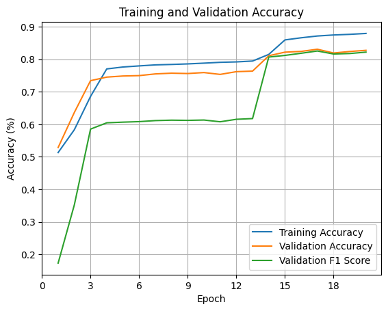
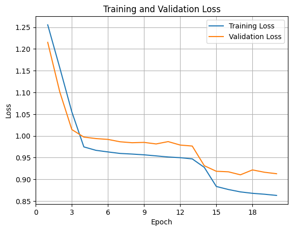
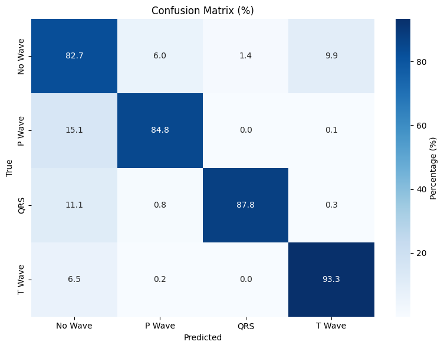
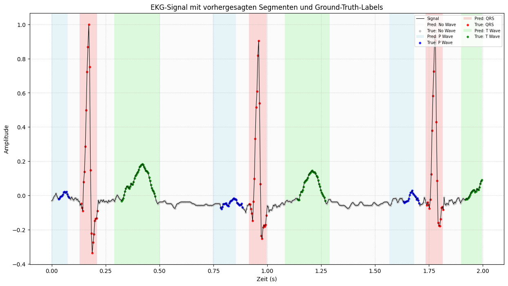
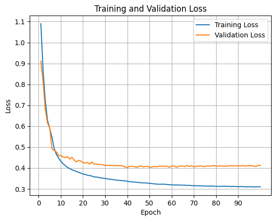
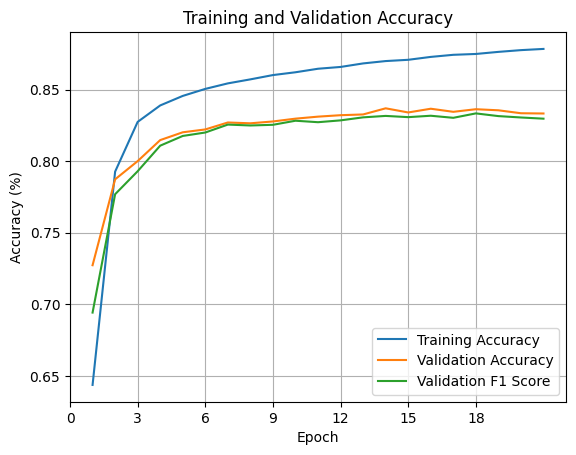
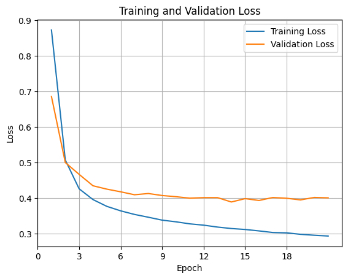
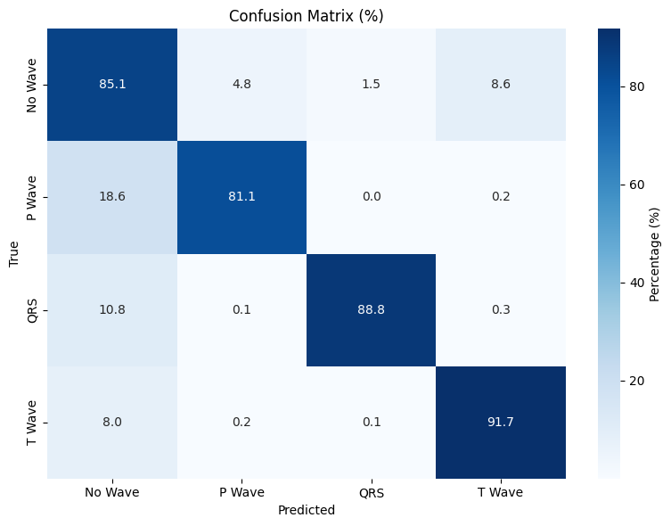
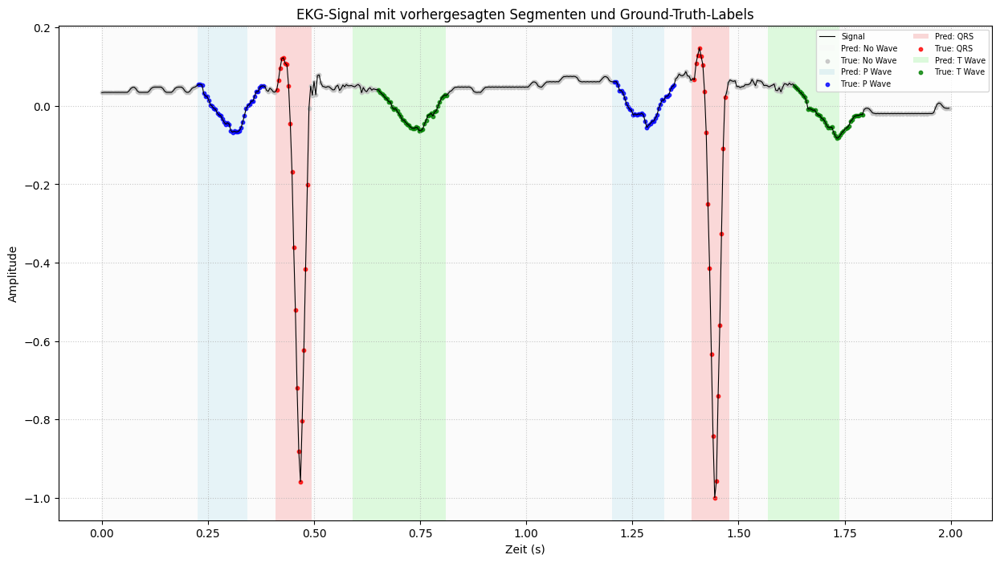
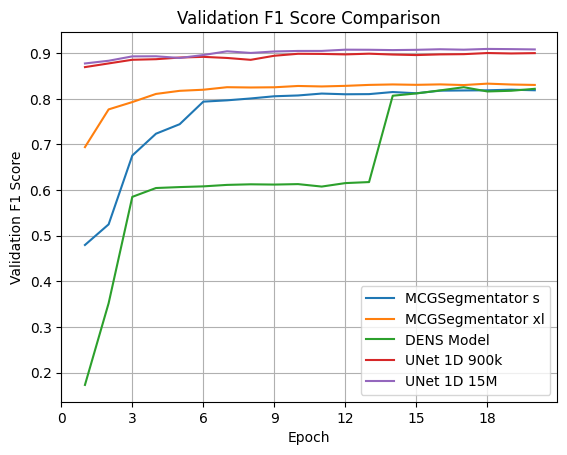

# ECG Segmentation Project Documentation

## Table of Contents

- [1. Overview](#1-overview)
  - [1.1. Key Features](#11-key-features)
- [2. Project Structure](#2-project-structure)
- [3. Installation and Setup](#3-installation-and-setup)
  - [3.1. Dependencies](#31-dependencies)
  - [3.2. Dataset](#32-dataset)
  - [3.3. Data Preprocessing (`create_dataset.py` and `create_training_data.py`)](#33-data-preprocessing-create_datasetpy-and-create_training_datapy)
    - [3.3.1. Running Preprocessing](#331-running-preprocessing)
  - [3.4. Prepared Data Format](#34-prepared-data-format)
- [4. Data Loading (`data_loader.py`)](#4-data-loading-data_loaderpy)
  - [4.1. `ECGFullDataset` Class](#41-ecgfulldataset-class)
  - [4.2. Testing and Visualization](#42-testing-and-visualization)
- [5. Model Architecture (`model.py`)](#5-model-architecture-modelpy)
  - [5.0. Model Overview](#50-model-overview)
  - [5.1. Unet-1D-15M](#51-unet-1d-15m)
  - [5.2. Unet-1D-900k](#52-unet-1d-900k)
  - [5.3. MCG-Segmentator_s](#53-mcg-segmentator_s)
  - [5.4. MCG-Segmentator_xl](#54-mcg-segmentator_xl)
  - [5.5. DENS-Model](#55-dens-model)
- [6. Training (`trainer.py` and `train.py`)](#6-training-trainerpy-and-trainpy)
  - [6.1. `Trainer` Class](#61-trainer-class)
  - [6.2. Training Script (`train.py`)](#62-training-script-trainpy)
- [7. Evaluation (`evaluate.py`)](#7-evaluation-evaluatepy)
- [8. Example Workflow](#8-example-workflow)
- [9. Training Process and Results](#9-training-process-and-results)
  - [9.1. General Training Setup](#91-general-training-setup)
  - [9.2. DENS-Model Results](#92-dens-model-results)
  - [9.3. MCG-Segmentator_s Results](#93-mcg-segmentator_s-results)
  - [9.4. MCG-Segmentator_xl Results](#94-mcg-segmentator_xl-results)
  - [9.5. Unet-1D-15M Results](#95-unet-1d-15m-results)
  - [9.6. Unet-1D-900k Results](#96-unet-1d-900k-results)
  - [9.7. Summary of Model Performance](#97-summary-of-model-performance)
- [10. Possible Applications to Magnetocardiography and ECG](#10-possible-applications-to-magnetocardiography-and-ecg)

## 1. Overview

The ECG Segmentation Project provides a robust Python-based framework for segmenting Electrocardiogram (ECG) signals into their core cardiac cycle components: No Wave, P-Wave, QRS Complex, and T-Wave. Built using PyTorch, this framework processes ECG data from the QT Database (QTDB) and supports advanced features such as data augmentation, multi-scale feature extraction, and comprehensive visualization tools. The primary goal is to develop deep learning models for precise ECG/MCG segmentation, enabling applications like QRS peak detection, average waveform generation, and computation of the magnetic field vector area during the T-wave to differentiate Arrhythmogenic Right Ventricular Cardiomyopathy (ARVC) from healthy cardiac conditions.
(c.f. [Magnetocardiography To Screen Adults with Arrhythmogenic Cardiomyopathy: a pilot study](https://github.com/Drizzr/Bachelorarbeit))

### 1.1. Key Features

- **Data Sources**: Utilizes the QT Database (QTDB) and the Lobachevsky University Database (LUDB) from PhysioNet, providing diverse ECG datasets for training and validation. QTDB offers 105 two-lead, 15-minute recordings at 250 Hz, while LUDB provides 200 12-lead, 10-second recordings at 500 Hz, both with detailed annotations for P, QRS, and T waves.
- **Preprocessing**: Includes scripts (`create_dataset.py`) to download QTDB and LUDB, parse annotations, label segments (No Wave, P-Wave, QRS Complex, T-Wave), and a script (`create_training_data.py`) to split data into training and validation sets stored in `Datasets/train/` and `Datasets/val/`.
- **Data Loading**: Loads ECG data from CSV files in `Datasets/base/qtdb/processed/` and `Datasets/base/ludb/processed/`, applies bandpass filtering (implicitly via data characteristics or configurable), and augments with noise (sinusoidal, Gaussian, baseline wander) to simulate real-world conditions.
- **Data Augmentation**: Enhances model robustness through time shifting, amplitude scaling, and noise addition (sinusoidal, Gaussian, baseline wander), applied during training via the `ECGFullDataset` class.
- **Model Architectures**:
  - `Unet-1D-15M`: A large-scale 1D U-Net model with approximately 15 million parameters, designed for high-capacity ECG segmentation.
  - `Unet-1D-900k`: A lighter 1D U-Net model with approximately 900,000 parameters, optimized for efficiency.
  - `MCG-Segmentator_s`: A small-scale model tailored for magnetocardiogram (MCG) and ECG segmentation, balancing performance and computational efficiency.
  - `MCG-Segmentator_xl`: A larger-scale model for enhanced MCG and ECG segmentation, incorporating advanced feature extraction.
  - `DENS-Model`: Based on the DENS-ECG paper, featuring convolutional layers followed by BiLSTM layers for robust sequence modeling.
  - `ECGSegmenter`: A sophisticated model combining positional encoding, multi-scale convolutions (kernel sizes 3, 7, 15), residual blocks, BiLSTM, and Transformer-based self-attention for comprehensive feature extraction.

- **Training**: Configurable pipeline with Cosine Annealing learning rate scheduling, gradient clipping, and CSV logging of metrics (loss, accuracy, F1-score) in `trained_models/[model_name]/logs/`.
- **Evaluation and Postprocessing**: Generates detailed metrics (accuracy, F1-score, confusion matrix, classification report) and visualizations (signal plots with true/predicted labels) saved in `trained_models/[model_name]/evaluation_results/`. Postprocessing follows AAMI standards, evaluating onset/offset detection within a 150ms neighborhood, computing mean error, standard deviation, sensitivity, PPV, and F1-score.

- **Extensibility**: Modular design facilitates integration of new models in `model.py`, additional datasets in `Datasets/base/`, or custom augmentation techniques in `data_loader.py`.

## 2. Project Structure

The project is organized as follows:

```
project_root/
├── Datasets/
│   ├── base/
│   │   ├── qtdb/
│   │   │   ├── raw/                # Raw QTDB files (downloaded by create_dataset.py)
│   │   │   └── processed/          # Processed QTDB CSV files
│   │   │   └── create_dataset.py   # Preprocess QTDB data
│   │   ├── ludb/
│   │   │   ├── raw/                # Raw LUDB files (downloaded by create_dataset.py)
│   │   │   └── processed/          # Processed LUDB CSV files
│   │   │   └── create_dataset.py   # Preprocess LUDB data
│   ├── train/                      # Training CSV files (generated by create_training_data.py)
│   ├── val/                        # Validation CSV files (generated by create_training_data.py)
│   └── create_training_data.py     # Logic to create the train/val split
├── model/
│   ├── data_loader.py              # Dataset and DataLoader for ECG data
│   ├── model.py                    # Model architectures and loss functions
│   └── trainer.py                  # Training logic and logging
├── train.py                        # Main training script
├── evaluate.py                     # Evaluation script
├── trained_models/
│   ├── Unet-1D-15M/
│   │   ├── checkpoints/            # Saved model checkpoints for Unet-1D-15M
│   │   ├── logs/                   # Training metrics CSV for Unet-1D-15M
│   │   └── evaluation_results/     # Evaluation plots and metrics for Unet-1D-15M
│   ├── Unet-1D-900k/
│   │   ├── checkpoints/            # Saved model checkpoints for Unet-1D-900k
│   │   ├── logs/                   # Training metrics CSV for Unet-1D-900k
│   │   └── evaluation_results/     # Evaluation plots and metrics for Unet-1D-900k
│   ├── MCG-Segmentator_s/
│   │   ├── checkpoints/            # Saved model checkpoints for MCG-Segmentator_s
│   │   ├── logs/                   # Training metrics CSV for MCG-Segmentator_s
│   │   └── evaluation_results/     # Evaluation plots and metrics for MCG-Segmentator_s
│   ├── MCG-Segmentator_xl/
│   │   ├── checkpoints/            # Saved model checkpoints for MCG-Segmentator_xl
│   │   ├── logs/                   # Training metrics CSV for MCG-Segmentator_xl
│   │   └── evaluation_results/     # Evaluation plots and metrics for MCG-Segmentator_xl
│   ├── DENS-Model/
│   │   ├── checkpoints/            # Saved model checkpoints for DENS-Model
│   │   ├── logs/                   # Training metrics CSV for DENS-Model
│   │   └── evaluation_results/     # Evaluation plots and metrics for DENS-Model
└── requirements.txt                # Python dependencies
```

## 3. Installation and Setup

### 3.1. Dependencies

Install the required Python libraries using:

```bash
pip install -r requirements.txt
```

Required libraries include:

- torch
- numpy
- pandas
- matplotlib
- scikit-learn
- seaborn
- tqdm
- json
- csv
- logging
- wfdb

Ensure PyTorch is compatible with your hardware (CUDA for GPU support). Check PyTorch’s official site for installation instructions.

### 3.2. Dataset

The project utilizes two key datasets from PhysioNet for ECG segmentation: the **QT Database (QTDB)** and the **Lobachevsky University Database (LUDB)**. Both datasets are processed using the `create_dataset.py` script, which downloads raw data, parses annotations, and generates CSV files stored in `Datasets/base/qtdb/processed/` and `Datasets/base/ludb/processed/`, with training and validation splits in `Datasets/train/` and `Datasets/val/`. Below is a detailed description of each dataset and their roles in the project.

#### QT Database (QTDB)

The [QT Database (QTDB)](https://physionet.org/content/qtdb/1.0.0/), hosted on PhysioNet, is a widely used dataset for ECG analysis, particularly for evaluating algorithms that measure QT intervals and segment cardiac waveforms.

- **Composition**: Contains 105 two-lead ECG recordings, each approximately 15 minutes long, sampled at 250 Hz.
- **Annotations**: Includes manual annotations for the onset, peak, and end of P, QRS, T, and U waves, enabling precise segmentation tasks.
- **Characteristics**: Captures a diverse range of QRS and ST-T morphologies, making it suitable for testing model robustness across varied cardiac patterns.
- **Reference**: Laguna P, Mark RG, Goldberger AL, Moody GB. A Database for Evaluation of Algorithms for Measurement of QT and Other Waveform Intervals in the ECG. *Computers in Cardiology* 24:673-676 (1997).

#### Lobachevsky University Database (LUDB)

The [Lobachevsky University Database (LUDB)](https://physionet.org/content/ludb/1.0.1/) is a more recent open-access dataset designed for validating ECG delineation algorithms. It complements QTDB with its unique characteristics.

- **Composition**: Includes 200 unique subjects, each with 12-lead ECG recordings lasting 10 seconds, sampled at 500 Hz.
- **Annotations**: Provides comprehensive annotations for the onset and offset of P, QRS, and T waves for each lead, resulting in a higher number of annotated beats compared to QTDB.
- **Usage**: In this project, LUDB serves two purposes:
  1. **Validation**: Used alongside QTDB to evaluate the delineation performance of the segmentation models, allowing comparison with existing methods.
  2. **Training**: Leveraged as a training dataset to study model performance on various arrhythmias, benefiting from its diverse, high-resolution multi-lead signals.
- **Reference**: Kalinin A, et al. The Lobachevsky University Electrocardiography Database. *PhysioNet* (2020).

#### Dataset Comparison

The following table summarizes the key characteristics of the QTDB and LUDB datasets used in the project:

| Data Source | # Recordings | Duration      | Frequency | Leads | Boundary Annotations          |
|-------------|--------------|---------------|-----------|-------|-------------------------------|
| QTDB        | 105          | 15 minutes    | 250 Hz    | 2     | P, QRS on/offsets, T offsets  |
| LUDB        | 200          | 10 seconds    | 500 Hz    | 12    | P, QRS, T on/offsets          |

### 3.3. Data Preprocessing (`create_dataset.py` and `create_training_data.py`)

The project employs three preprocessing scripts to prepare the QT Database (QTDB) and Lobachevsky University Database (LUDB) for ECG segmentation: `Datasets/base/qtdb/create_dataset.py` for QTDB, `Datasets/base/ludb/create_dataset.py` for LUDB, and `Datasets/create_training_data.py` for splitting processed data into training, validation, and test sets. These scripts, adapted from the [KardioNet repository](https://github.com/Seb-Good/kardionet), generate CSV files stored in `Datasets/base/qtdb/processed/` and `Datasets/base/ludb/processed/`, with splits in `Datasets/train/`, `Datasets/val/`, and `Datasets/test/`. Records with only QRS annotations are manually excluded for QTDB via `create_training_data.py` to ensure high-quality multi-class segmentation data.

For QTDB, most records lack T-wave onset annotations. To address this, the QTDB preprocessing script estimates T-wave onsets by inserting a gap sampled from a normal distribution (mean 100 ms, standard deviation 20 ms) between QRS offset and T-wave offset, ensuring at least 50% of the T-wave segment remains.

#### Key Operations (QTDB Preprocessing)

- **Download**: Fetches QTDB data from PhysioNet into `Datasets/base/qtdb/raw/` using `wfdb.dl_database` if not already present.
- **Parse Annotations**: Reads waveform data (`.dat`, `.hea`) and annotation files (e.g., `.q1c`, `.pu`) for each record.
- **Extract Labeled Intervals**: Identifies P-wave, QRS complex, and T-wave segments using annotation symbols (`p`, `N`, `A`, `t`). Gaps between waves are labeled as "No Wave" (`na`).
- **Labels**: Assigns integer labels: 0 (No Wave), 1 (P-Wave), 2 (QRS Complex), 3 (T-Wave).
- **Handle Gaps & Overlaps**: Uses a `gap_tolerance` parameter (1 second) to insert `break` markers for large gaps or `na` labels for smaller gaps. Overlaps are resolved by keeping non-overlapping segments.
- **T-Wave Onset Estimation**: For records missing T-wave onsets, inserts a gap (sampled from a normal distribution with mean 100 ms and 20 ms standard deviation) between QRS offset and T-wave offset, ensuring at least 50% of the T-wave segment remains.
- **Save Processed Data**: Saves per-channel CSVs in `Datasets/base/qtdb/processed/` with filenames like `<record_name>_ch<channel>.csv`.

#### Key Operations (LUDB Preprocessing)

- **Download**: Fetches LUDB data from PhysioNet into `Datasets/base/ludb/raw/` if not already present.
- **Resample**: Resamples 500 Hz signals to 250 Hz using `scipy.signal.resample` to match QTDB's sampling frequency.
- **Parse Annotations**: Reads waveform data (`.dat`, `.hea`) and per-lead annotations (e.g., `.i`, `.ii`, ..., `.v6`) for 12 leads.
- **Extract Labeled Intervals**: Identifies P-wave, QRS complex, and T-wave segments per lead, labeling gaps as "No Wave" (`na`).
- **Labels**: Uses the same integer labels as QTDB: 0 (No Wave), 1 (P-Wave), 2 (QRS Complex), 3 (T-Wave).
- **Handle Gaps & Overlaps**: Applies a `gap_tolerance` of 100 ms to insert `na` labels for small gaps or `break` markers for larger gaps. Overlaps are resolved by keeping non-overlapping segments.
- **Save Processed Data**: Saves per-lead CSVs in `Datasets/base/ludb/processed/` with filenames like `<patient_id>_<lead>.csv`.

#### Key Operations (Data Splitting)

The `Datasets/create_training_data.py` script splits processed CSV files from both datasets into training, validation, and test sets, stored in `Datasets/train/`, `Datasets/val/`, and `Datasets/test/`.

- **Filter Records**: For QTDB, manually excludes records with incomplete annotations (e.g., only QRS labeled) by specifying them in `qtdb_exclude_records` (e.g., `sel102`, `sel104`, etc.), which are moved to the test set. LUDB records are not excluded.
- **Split Data**: Randomly shuffles valid records and splits them into training (80%) and validation (20%) sets using a fixed `random_seed` (123). Excluded QTDB records are copied to `Datasets/test/`.
- **Copy Files**: Copies CSV files to the appropriate directories (`train/`, `val/`, or `test/`) based on record names, preserving channel/lead-specific files.

#### Key Components (QTDB)

- **QTDB Class**:
  - Manages downloading raw QTDB data (`wfdb.dl_database`).
  - Iterates through records, creating `Record` objects and saving processed CSVs.
- **Record Class**:
  - Loads waveforms (`wfdb.rdrecord`) and annotations (`wfdb.rdann`).
  - `_get_labels()`: Extracts P, QRS, and T-wave segments, handling annotation symbols and estimating T-wave onsets.
  - `_add_gap_labels()`: Inserts `na` labels for gaps below `gap_tolerance` or `break` markers for larger gaps.
  - `_get_intervals_df()`: Converts labeled segments into a Pandas DataFrame with columns for time, index, labels, waveforms, and interval IDs.
  - `save_csv()`: Saves per-channel CSVs to `Datasets/base/qtdb/processed/`.
- **Helper Functions**:
  - `_create_directory()`: Creates directories with `.gitignore` files.
  - `plot_waveform()`: Visualizes processed waveforms with labeled intervals, saved as PNGs.

#### Key Components (LUDB)

- **LUDBProcessor Class**:
  - Manages downloading and processing LUDB data.
  - Resamples signals from 500 Hz to 250 Hz.
  - Processes each of the 12 leads individually, handling per-lead annotations.
  - `_get_labels()`: Extracts P, QRS, and T-wave segments per lead, ensuring non-overlapping intervals.
  - `_add_gap_labels()`: Inserts `na` labels for gaps below 100 ms or `break` markers for larger gaps.
  - `_create_labels_array()`: Creates a labels array restricted to the first and last labeled indices.
  - Saves per-lead CSVs to `Datasets/base/ludb/processed/`.
- **Helper Functions**:
  - `plot_random_waveform()`: Visualizes a random processed waveform with labeled segments, displayed for inspection.

#### Key Components (Data Splitting)

- **split_files Function**:
  - Filters out specified QTDB records (e.g., `sel102`, `sel104`) to the test set.
  - Shuffles and splits valid records into training (80%) and validation (20%) sets.
  - Copies CSV files to `Datasets/train/`, `Datasets/val/`, or `Datasets/test/` using `shutil.copy2`.
- **create_directory Function**:
  - Creates directories with `.gitignore` files for `train/`, `val/`, and `test/`.

#### 3.3.1. Running Preprocessing

1. **For QTDB**:
   ```bash
   cd Datasets/base/qtdb
   python create_dataset.py
   ```

2. **For LUDB**:
   ```bash
   cd Datasets/base/ludb
   python create_dataset.py
   ```

3. **For Data Splitting**:
   ```bash
   cd Datasets
   python create_training_data.py
   ```

Parameters like `DATA_DIR`, `random_seed`, `gap_mean_ms`, `gap_std_dev_ms`, and `min_t_wave_ratio_remaining` (QTDB) or `dataset_path` and `output_path` (LUDB) can be modified in the scripts' `__main__` block or class instantiation. The `qtdb_exclude_records` list in `create_training_data.py` can be updated to exclude additional records.

### 3.4. Prepared Data Format

After running the preprocessing scripts, the project expects ECG data in CSV format, stored in `Datasets/base/qtdb/processed/` and `Datasets/base/ludb/processed/`, with splits in `Datasets/train/`, `Datasets/val/`, and `Datasets/test/`. Each CSV file contains:

- **Columns**:
  - `time`: Time in seconds.
  - `index`: Sample index.
  - `label`: String label (`na`, `p`, `n`, `a`, `t`).
  - `train_label`: Integer label (0: No Wave, 1: P-Wave, 2: QRS, 3: T-Wave).
  - `wave_form`: ECG signal amplitude for the channel/lead.
  - `interval` (QTDB only): Interval ID for contiguous labeled segments.

- **QTDB CSV Structure** (e.g., `sel100_ch1.csv`):
  ```csv
  time,index,label,train_label,interval,wave_form
  0.0,0,na,0,0,-0.100
  0.004,1,na,0,0,-0.100
  0.220,55,p,1,0,-0.125
  ...
  ```

- **LUDB CSV Structure** (e.g., `1_i.csv`):
  ```csv
  time,index,label,train_label,wave_form
  0.0,0,na,0,-0.050
  0.004,1,na,0,-0.050
  0.220,55,p,1,-0.030
  ...
  ```

Ensure the data directory paths in `train.py` and `evaluate.py` (`--data_dir_train`, `--data_dir_val`, `--data_dir_eval`) point to `Datasets/train/` and `Datasets/val/` for training and evaluation, with `Datasets/test/` used for testing if applicable.

## 4. Data Loading (`data_loader.py`)

### 4.1. `ECGFullDataset` Class

The `ECGFullDataset` class, defined in `model/data_loader.py`, loads processed ECG data from CSV files in `Datasets/train/` or `Datasets/val/`, applies advanced data augmentation to simulate physiological noise, and prepares 1D sequences for training and evaluation of 1D CNN/RNN models. The class supports both QTDB and LUDB datasets, handling single-channel (QTDB: `ch1`, `ch2`; LUDB: `i`, `ii`, ..., `v6`) signals and their corresponding labels.

**Key Features**:

- Loads CSV files from a specified directory (e.g., `Datasets/train/` or `Datasets/val/`).
- Slices signals into overlapping sequences for model input.
- Applies data augmentation to mimic physiological noise, including baseline wander, powerline noise, Gaussian noise, amplitude scaling, and random time shifting.
- Normalizes signals to zero mean and scales to the [-1, 1] range.
- Returns sequences with shape `(1, sequence_length)` (single channel) and corresponding integer labels.

**Initialization**:

```python
from model.data_loader import ECGFullDataset

dataset = ECGFullDataset(
    data_dir="Datasets/train",
    channel_names=["wave_form"],
    label_column="train_label",
    sequence_length=500,
    overlap=125,
    sinusoidal_noise_mag=0.05,
    gaussian_noise_std=0.04,
    baseline_wander_mag=0.1,
    baseline_wander_freq_max=0.5,
    amplitude_scale_range=0.1,
    max_time_shift=5,
    augmentation_prob=1.0
)
```

**Parameters**:

| Parameter                 | Type      | Default | Description                                                                 |
|---------------------------|-----------|---------|-----------------------------------------------------------------------------|
| `data_dir`                | str       | —       | Directory containing processed CSV files (e.g., `Datasets/train/`).         |
| `channel_names`           | List[str] | ["wave_form"] | Column name for ECG signal in CSV (e.g., `wave_form` for LUDB, `ch1` for QTDB). |
| `label_column`            | str       | "train_label" | Column name for integer labels (0: No Wave, 1: P-Wave, 2: QRS, 3: T-Wave). |
| `file_extension`          | str       | ".csv"  | File extension for data files.                                              |
| `sequence_length`         | int       | 512     | Length of each input sequence (in samples).                                 |
| `overlap`                 | int       | 256     | Overlap between consecutive sequences (in samples).                         |
| `sinusoidal_noise_mag`    | float     | 0.05    | Magnitude of powerline noise (simulating 50 Hz interference).                |
| `gaussian_noise_std`      | float     | 0.04    | Standard deviation of Gaussian noise (in mV).                               |
| `baseline_wander_mag`     | float     | 0.1     | Magnitude of baseline wander noise.                                         |
| `baseline_wander_freq_max`| float     | 0.5     | Maximum frequency for baseline wander (in Hz).                              |
| `amplitude_scale_range`   | float     | 0.1     | Range for random amplitude scaling (±10% if 0.1).                           |
| `max_time_shift`          | int       | 5       | Maximum time shift in samples for random shifting.                          |
| `augmentation_prob`       | float     | 1.0     | Probability of applying each augmentation type.                             |

**Data Augmentation**:

To enhance model robustness, the `ECGFullDataset` class applies the following augmentations, designed to mimic physiological and environmental noise in ECG signals, based on techniques described in the referenced work:

- **Baseline Wander**: Simulates low-frequency drift using a sum of cosine functions:
  
  $n_{blw}(t) = \sum_{k=1}^{N} a_k \cos(2\pi t k \Delta f + \phi_k)$
  
  where $N$ is a random integer (1 to 3), $\Delta f = 0.01$ Hz, $a_k$ is sampled uniformly from $[-\text{baseline\_wander\_mag}, \text{baseline\_wander\_mag}]$, and $\phi_k$ from $[0, 2\pi)$.

- **Powerline Noise**: Simulates 50 Hz powerline interference using:
  
  $n_{pln}(t) = \sum_{k=1}^{M} a_k \cos(2\pi t k f_n + \phi_k)$
  
  where $M$ is a random integer (2 to 5), $f_n$ is a random frequency (1 to 30 Hz), $a_k$ is sampled uniformly from $[0, \text{sinusoidal\_noise\_mag}]$, and $\phi_k$ from $[0, 2\pi)$.

- **Gaussian Noise**: Adds random noise with zero mean and standard deviation `gaussian_noise_std` (default 0.04 mV).

- **Amplitude Scaling**: Resizes the signal by a factor $\exp(\alpha)$, where $\alpha$ is uniformly sampled from $[-\text{amplitude\_scale\_range}, \text{amplitude\_scale\_range}]$ (e.g., ±10% for 0.1).

- **Time Shifting**: Shifts the signal by a random number of samples (up to `max_time_shift`), padding with the first or last signal value to maintain sequence length.

Each augmentation is applied with probability `augmentation_prob` (default 1.0 during training), ensuring diverse training data to improve model generalization in noisy real-world conditions.

**Methods**:

- `_load_and_slice_all`: Loads all CSV files from `data_dir` and slices signals into sequences using `_slice_channel_sequences`.
- `_slice_channel_sequences`: Creates overlapping sequences from a single channel's data with specified `sequence_length` and `overlap`.
- `__getitem__`: Returns a processed sequence (tensor of shape `(1, sequence_length)`) and its labels (tensor of shape `(sequence_length,)`), applying augmentations and normalization.

**Output per Item**:

- **Signal**: `(1, sequence_length)` tensor, representing a single-channel ECG sequence, normalized to zero mean and [-1, 1] range.
- **Labels**: `(sequence_length,)` tensor of integer labels (0: No Wave, 1: P-Wave, 2: QRS, 3: T-Wave).

### 4.2. Testing and Visualization

The `data_loader.py` script includes a test block to verify the dataset functionality and visualize augmented signals:

```python
if __name__ == "__main__":
    dataset = ECGFullDataset(
        data_dir="Datasets/train",
        sequence_length=500,
        overlap=125,
        sinusoidal_noise_mag=0.05,
        gaussian_noise_std=0.04,
        baseline_wander_mag=0.1,
        amplitude_scale_range=0.1,
        max_time_shift=5,
        augmentation_prob=1.0
    )
    loader = DataLoader(dataset, batch_size=1, shuffle=True)
    signal, labels = next(iter(loader))
```

This block generates a plot with two subplots:
1. The processed signal with colored dots indicating ground truth labels (No Wave: silver, P-Wave: blue, QRS: red, T-Wave: green).
2. The label sequence as a step plot, showing the ground truth labels over time.

The plot helps verify that augmentations and labels are correctly applied, ensuring the dataset is ready for training.


## 5. Model Architecture (`model.py`)

This section describes the five deep learning models implemented in `model/model.py` for ECG segmentation, inspired by recent advances in deep learning-based ECG analysis. The models include two U-Net variants (Unet-1D-15M and Unet-1D-900k), two MCG-Segmentator variants (MCG-Segmentator_s and MCG-Segmentator_xl), and the DENS-Model. Each model is designed to segment ECG signals into four classes: No Wave (0), P-Wave (1), QRS Complex (2), and T-Wave (3). Below is an overview of the models, their architectures, and training details, followed by detailed descriptions of each model.

### 5.0. Model Overview

The following table summarizes the five models, their parameter counts, training configurations, and performance metrics. All models were trained on a combination of QTDB and LUDB datasets, using the `ECGFullDataset` class with augmentations (baseline wander, powerline noise, Gaussian noise, amplitude scaling, and time shifting) as described in Section 4. The loss function used is Focal Loss to address class imbalance, with training performed using the Adam optimizer and a cosine annealing learning rate schedule (initial learning rate: 0.001).


| Model Name         | # Parameters | Loss Function | Datasets Used | Total Epochs |
|--------------------|--------------|---------------|---------------|--------------|
| Unet-1D-15M        | ~15,022,724  | Focal Loss    | QTDB, LUDB    | 40           |
| Unet-1D-900k       | ~937,540     | Focal Loss    | QTDB, LUDB    | 50           |
| MCG-Segmentator_s  | ~375,692     | Cross Entropy | QTDB          | 100          |
| MCG-Segmentator_xl | ~1,339,620   | Cross Entropy | QTDB          | 21           |
| DENS-Model         | ~1,419,044   | Cross Entropy | QTDB          | 20           |

### 5.1. Unet-1D-15M

**Architecture inspired by**: Joung, C., Kim, M., Paik, T., Kong, S.H., Oh, S.Y., Jeon, W.K., Jeon, J.H., Hong, J.S., Kim, W.J., Kook, W., Cha, M.J., & van Koert, O. (2023). Deep learning based ECG segmentation for delineation of diverse arrhythmias. *PLOS ONE*, 18(4), e0284791. https://doi.org/10.1371/journal.pone.0284791

The Unet-1D-15M model is a large-scale 1D U-Net with multi-head self-attention, designed for high-capacity ECG segmentation.

**Architecture**:

- **Encoder**: Three convolutional blocks (`ConvBlock1D`) with feature sizes [64, 128, 256, 512], each followed by max-pooling (stride 2).
- **Bottleneck**: A convolutional block with 256 channels, followed by multi-head self-attention (8 heads, dropout=0.4).
- **Decoder**: Three upsampling blocks (`ConvTranspose1d`) with skip connections from the encoder, reducing features back to 32.
- **Output**: A 1x1 convolution mapping to `num_classes` (4), producing per-timestep logits.

**Initialization**:

```python
from model.model import UNet1D

model = UNet1D(num_classes=4, input_channels=1, features=[64, 128, 256, 512], dropout=0.4, num_heads=8)
```

**Parameters**:

| Parameter         | Type      | Default             | Description                                          |
|-------------------|-----------|---------------------|------------------------------------------------------|
| `num_classes`     | int       | 4                   | Number of output classes (0-3).                      |
| `input_channels`  | int       | 1                   | Number of input ECG channels.                        |
| `features`        | List[int] | [64, 128, 256, 512] | Feature sizes for encoder/decoder blocks.            |
| `dropout`         | float     | 0.4                 | Dropout rate in attention and convolutional layers.  |
| `num_heads`       | int       | 8                   | Number of attention heads in MHSA.                   |

**Input/Output**:

- **Input**: `(batch_size, input_channels, sequence_length)`
- **Output**: `(batch_size, sequence_length, num_classes)` (logits)

**Architecture Diagram**:


### 5.2. Unet-1D-900k

**Architecture inspired by**: Joung, C., Kim, M., Paik, T., Kong, S.H., Oh, S.Y., Jeon, W.K., Jeon, J.H., Hong, J.S., Kim, W.J., Kook, W., Cha, M.J., & van Koert, O. (2023). Deep learning based ECG segmentation for delineation of diverse arrhythmias. *PLOS ONE*, 18(4), e0284791. https://doi.org/10.1371/journal.pone.0284791

The Unet-1D-900k model is a lightweight version of the U-Net, optimized for lower computational cost while maintaining performance.

**Architecture**:

- Similar to Unet-1D-15M but with reduced feature sizes [32, 64, 128] and no dropout in the attention layer.
- **Encoder**: Three convolutional blocks with smaller feature sizes.
- **Bottleneck**: A convolutional block with 128 channels, followed by multi-head self-attention (4 heads, dropout=0.0).
- **Decoder**: Three upsampling blocks with skip connections.
- **Output**: A 1x1 convolution mapping to `num_classes`.

**Initialization**:

```python
from model.model import UNet1D

model = UNet1D(num_classes=4, input_channels=1, features=[32, 64, 128], dropout=0.0, num_heads=4)
```

**Parameters**:

| Parameter         | Type      | Default         | Description                                          |
|-------------------|-----------|-----------------|------------------------------------------------------|
| `num_classes`     | int       | 4               | Number of output classes (0-3).                      |
| `input_channels`  | int       | 1               | Number of input ECG channels.                        |
| `features`        | List[int] | [32, 64, 128]   | Feature sizes for encoder/decoder blocks.            |
| `dropout`         | float     | 0.0             | Dropout rate in attention layer (0 for efficiency).  |
| `num_heads`       | int       | 4               | Number of attention heads in MHSA.                   |

**Input/Output**:

- **Input**: `(batch_size, input_channels, sequence_length)`
- **Output**: `(batch_size, sequence_length, num_classes)` (logits)

### 5.3. MCG-Segmentator_s

The MCG-Segmentator_s is a smaller variant of the `ECGSegmenter` model, designed for efficiency in resource-constrained environments.

**Architecture**:

- **Positional Encoding**: Adds temporal context for sequences up to `max_seq_len`.
- **Initial Convolution**: Expands input to 16 channels (kernel size 7).
- **Multi-Scale Convolutions**: Kernels [3, 7, 15] for varied receptive fields.
- **Residual Blocks**: Four blocks with dilations [1, 2, 4, 8].
- **BiLSTM**: Single layer with 20 hidden units (bidirectional).
- **Transformer Encoder**: Single layer with 8 attention heads.
- **Skip Connection**: Combines early convolutional features with LSTM output.
- **Classifier**: Linear layer to `num_classes`.

**Initialization**:

```python
from model.model import ECGSegmenter

model = ECGSegmenter(num_classes=4, input_channels=1, hidden_channels=16, lstm_hidden=20, dropout_rate=0.3, max_seq_len=2000)
```

**Parameters**:

| Parameter         | Type  | Default | Description                                      |
|-------------------|-------|---------|--------------------------------------------------|
| `num_classes`     | int   | 4       | Number of output classes (0-3).                  |
| `input_channels`  | int   | 1       | Number of input ECG channels.                    |
| `hidden_channels` | int   | 16      | Base number of convolutional hidden channels.    |
| `lstm_hidden`     | int   | 20      | Hidden size of BiLSTM.                           |
| `dropout_rate`    | float | 0.3     | Dropout probability.                             |
| `max_seq_len`     | int   | 2000    | Maximum sequence length for positional encoding. |

**Input/Output**:

- **Input**: `(batch_size, input_channels, sequence_length)`
- **Output**: `(batch_size, sequence_length, num_classes)` (logits)

**Architecture Diagram**:


### 5.4. MCG-Segmentator_xl

The MCG-Segmentator_xl is a larger variant of the `ECGSegmenter` model, designed for enhanced performance on complex ECG patterns.

**Architecture**:

- Similar to MCG-Segmentator_s but with increased capacity: 64 hidden channels and 64 LSTM hidden units.
- **Positional Encoding**: Same as MCG-Segmentator_s.
- **Initial Convolution**: Expands to 32 channels.
- **Multi-Scale Convolutions**: Same kernel sizes [3, 7, 15].
- **Residual Blocks**: Four blocks with dilations [1, 2, 4, 8].
- **BiLSTM**: Single layer with 64 hidden units (bidirectional).
- **Transformer Encoder**: Single layer with 8 attention heads.
- **Skip Connection**: Combines early features with LSTM output.
- **Classifier**: Linear layer to `num_classes`.

**Initialization**:

```python
from model.model import ECGSegmenter

model = ECGSegmenter(num_classes=4, input_channels=1, hidden_channels=64, lstm_hidden=64, dropout_rate=0.3, max_seq_len=2000)
```

**Parameters**:

| Parameter         | Type  | Default | Description                                      |
|-------------------|-------|---------|--------------------------------------------------|
| `num_classes`     | int   | 4       | Number of output classes (0-3).                  |
| `input_channels`  | int   | 1       | Number of input ECG channels.                    |
| `hidden_channels` | int   | 32      | Base number of convolutional hidden channels.    |
| `lstm_hidden`     | int   | 64      | Hidden size of BiLSTM.                           |
| `dropout_rate`    | float | 0.3     | Dropout probability.                             |
| `max_seq_len`     | int   | 2000    | Maximum sequence length for positional encoding. |

**Input/Output**:

- **Input**: `(batch_size, input_channels, sequence_length)`
- **Output**: `(batch_size, sequence_length, num_classes)` (logits)

### 5.5. DENS-Model

**Based on**: Peimankar, A., & Puthusserypady, S. (2021). DENS-ECG: A deep learning approach for ECG signal delineation. *Expert Systems with Applications*, 165, 113911. https://doi.org/10.1016/j.eswa.2020.113911
**GitHub Repository**: https://github.com/RahmanPeimankar/dens-ecg-eswa-paper

The DENS-Model, inspired by the DENS-ECG paper, combines convolutional and recurrent layers for robust ECG segmentation.

**Architecture**:

- **Convolutional Layers**: Three Conv1d layers with channels [32, 64, 128] (kernel size 3, padding 1).
- **BiLSTM Layers**: Two bidirectional LSTMs with hidden sizes 250 and 125.
- **Dropout**: Applied after BiLSTM (p=0.2).
- **Classifier**: Linear layer mapping to `num_classes`, with softmax applied during inference (implicitly handled by CrossEntropyLoss during training).

**Initialization**:

```python
from model.model import DENS_ECG_segmenter

model = DENS_ECG_segmenter(input_channels=1, num_classes=4)
```

**Parameters**:

| Parameter         | Type | Default | Description                             |
|-------------------|------|---------|-----------------------------------------|
| `input_channels`  | int  | 1       | Number of input ECG channels.           |
| `num_classes`     | int  | 4       | Number of output classes (0-3).         |

**Input/Output**:

- **Input**: `(batch_size, input_channels, sequence_length)`
- **Output**: `(batch_size, sequence_length, num_classes)` (logits)

## 6. Training (`trainer.py` and `train.py`)

This section describes the training pipeline implemented in `trainer.py` and `train.py` for the ECG segmentation models (Unet-1D-15M, Unet-1D-900k, MCG-Segmentator_s, MCG-Segmentator_xl, and DENS-Model) defined in `model/model.py`. The pipeline uses the `ECGFullDataset` class to load preprocessed QTDB and LUDB data with augmentations (sinusoidal noise, Gaussian noise, baseline wander, amplitude scaling, and time shifting) and employs Focal Loss to address class imbalance. Training is performed using the Adam optimizer with a cosine annealing learning rate schedule.

### 6.1. `Trainer` Class

The `Trainer` class, defined in `trainer.py`, manages the training and validation loops, logging metrics to a CSV file and saving checkpoints.

**Initialization**:

```python
from model.trainer import Trainer

trainer = Trainer(
    model=model,
    train_loader=train_loader,
    val_loader=val_loader,
    args=args,
    optimizer=optimizer,
    device=device,
    log_filepath="MCG_segmentation/logs/training_metrics.csv",
    lr_scheduler=scheduler,
    init_epoch=1
)
```

**Key Methods**:

- `train()`: Executes the training loop over epochs, computing loss, accuracy, and updating model parameters using Focal Loss and gradient clipping.
- `validate()`: Evaluates the model on the validation set, computing loss, accuracy, and macro F1-score.
- `save_model()`: Saves model, optimizer, scheduler states, and training parameters to checkpoints.
- `_log_epoch_metrics()`: Logs epoch metrics to a CSV file.
- `focal_loss()`: Implements Focal Loss with `alpha=0.25` and `gamma=2.0`.

**Logged Metrics** (in `logs/training_metrics.csv`):

| Metric            | Description                                |
|-------------------|--------------------------------------------|
| `epoch`           | Current epoch number.                      |
| `train_loss`      | Average training loss for the epoch.       |
| `train_acc`       | Average training accuracy for the epoch.   |
| `val_loss`        | Average validation loss for the epoch.     |
| `val_acc`         | Average validation accuracy for the epoch. |
| `val_f1_macro`    | Macro-averaged F1-score on validation set. |
| `learning_rate`   | Current learning rate.                     |

### 6.2. Training Script (`train.py`)

The `train.py` script parses command-line arguments, sets up datasets, models, optimizers, schedulers, and the `Trainer` class, and initiates training. It supports all five models and allows resuming from checkpoints. It also automatically selects the most performant device available (cuda, mps or cpu).

**Usage Example**:

```bash
python train.py \
    --data_dir_train MCG_segmentation/Datasets/train \
    --data_dir_val MCG_segmentation/Datasets/val \
    --save_dir MCG_segmentation/checkpoints \
    --metrics_file MCG_segmentation/logs/training_metrics.csv \
    --model_name Unet1D \
    --num_epochs 50 \
    --batch_size 64 \
    --max_lr 1e-3 \
    --sequence_length 500 \
    --overlap 400 \
    --sinusoidal_noise_mag 0.04 \
    --augmentation_prob 0.80
```

**Key Arguments**:

| Argument                 | Type  | Default                                    | Description                                               |
|--------------------------|-------|--------------------------------------------|-----------------------------------------------------------|
| `--num_epochs`           | int   | 50                                         | Number of training epochs.                                |
| `--batch_size`           | int   | 64                                         | Training batch size.                                      |
| `--val_batch_size`       | int   | 4                                          | Validation batch size.                                    |
| `--max_lr`               | float | 1e-3                                       | Maximum learning rate for scheduler.                      |
| `--base_lr`              | float | 1e-5                                       | Minimum learning rate for cosine annealing.               |
| `--clip`                 | float | 1.0                                        | Gradient clipping value (0 to disable).                   |
| `--from_checkpoint`      | bool  | False                                      | Resume training from a checkpoint.                        |
| `--load_dir`             | str   | MCG_segmentation/checkpoints               | Directory to load checkpoint from.                        |
| `--save_dir`             | str   | MCG_segmentation/checkpoints               | Directory for saving new checkpoints.                     |
| `--data_dir_train`       | str   | MCG_segmentation/Datasets/train            | Training data directory.                                  |
| `--data_dir_val`         | str   | MCG_segmentation/Datasets/val              | Validation data directory.                                |
| `--sequence_length`      | int   | 500                                        | Input sequence length for the model.                      |
| `--overlap`              | int   | 400                                        | Overlap when creating sequences from files.               |
| `--num_workers`          | int   | 4                                          | Number of DataLoader workers.                             |
| `--sinusoidal_noise_mag` | float | 0.04                                       | Magnitude of sinusoidal noise for augmentation.           |
| `--gaussian_noise_std`   | float | 0.04                                       | Standard deviation of Gaussian noise for augmentation.    |
| `--baseline_wander_mag`  | float | 0.1                                        | Magnitude of baseline wander for augmentation.            |
| `--augmentation_prob`    | float | 0.80                                       | Probability of applying augmentations during training.    |
| `--metrics_file`         | str   | MCG_segmentation/logs/training_metrics.csv | Path for CSV logging of metrics.                          |
| `--print_freq`           | int   | 50                                         | Frequency of printing training stats (in steps).          |

**Checkpoints**:

- **Periodic Checkpoints**: Saved every 5 epochs in `save_dir/checkpoint_epoch_X/` with files `model.pth`, `optimizer.pth`, `lr_scheduler.pth`, and `params.json`.
- **Best Checkpoint**: Saved in `save_dir/best/` when the validation macro F1-score improves.
- **Resuming Training**: Enabled via `--from_checkpoint` and `--load_dir`, loading model, optimizer, scheduler states, and training parameters.

**Training Process**:

- **Optimizer**: Adam (or AdamW for new training) with initial learning rate set to `--max_lr`.
- **Learning Rate Schedule**: CosineAnnealingLR with `T_max` set to `num_epochs * len(train_loader)` steps, annealing to `--base_lr`.
- **Loss Function**: Focal Loss with `alpha=0.25` and `gamma=2.0`.
- **Datasets**: Preprocessed QTDB and LUDB datasets, split as described in Section 3.3, with augmentations applied during training (disabled for validation).
- **Progress Monitoring**: Uses `tqdm` for progress bars, printing loss, accuracy, and learning rate every `--print_freq` steps.
- **Error Handling**: Handles interruptions (e.g., KeyboardInterrupt) and errors by saving the model state before exiting.


## 7. Evaluation (`evaluate.py`)

The `evaluate.py` script evaluates a trained ECG segmentation model (specifically `DENS_ECG_segmenter`) on a validation dataset, computing metrics and generating visualizations to assess performance. It adheres to the Association for the Advancement of Medical Instrumentation (AAMI) standards, as described in Joung et al. (2023), considering an onset or offset correctly detected if it falls within a 150 ms neighborhood of a ground truth annotation [Joung, C., et al., 2023. Deep learning based ECG segmentation for delineation of diverse arrhythmias. PLOS ONE, 18(4), e0284791]. Predictions are post-processed before evaluation, following the approach proposed in Joung et al. (2023), to refine segment labels. The script calculates metrics such as accuracy, classification report, confusion matrix, and significant point detection metrics (sensitivity, positive predictive value, F1-score, mean error, and standard deviation of error) for P-Wave, QRS, and T-Wave onsets and offsets.

### Usage Example

```bash
python evaluate.py \
    --load_dir MCG_segmentation/trained_models/DENS-Model \
    --data_dir_eval MCG_segmentation/Datasets/val \
    --output_dir MCG_segmentation/trained_models/DENS-Model/evaluation_results \
    --sequence_length 500 \
    --eval_batch_size 16 \
    --num_workers 4
```

### Key Arguments

| Argument            | Type  | Default (example)                                           | Description                                                                     |
|---------------------|-------|-------------------------------------------------------------|---------------------------------------------------------------------------------|
| `--load_dir`        | str   | MCG_segmentation/trained_models/DENS-Model                  | Directory containing the model checkpoint (e.g., `checkpoints/best/model.pth`). |
| `--data_dir_eval`   | str   | MCG_segmentation/Datasets/val                               | Evaluation data directory.                                                      |
| `--output_dir`      | str   | MCG_segmentation/trained_models/DENS-Model/evaluation_results | Directory for saving evaluation outputs.                                        |
| `--eval_batch_size` | int   | 16                                                          | Batch size for evaluation.                                                      |
| `--sequence_length` | int   | 500                                                         | Sequence length for evaluation.                                                 |
| `--num_workers`     | int   | 4                                                           | Number of DataLoader workers.                                                   |

### Outputs

Saved in `output_dir`:
- **Confusion Matrix** (`confusion_matrix.pdf`): A heatmap visualizing the confusion matrix in percentage terms, with class labels (No Wave, P-Wave, QRS, T-Wave).
- **Sample Plot** (`ecg_segment_random_batch_X.pdf`): A plot for a randomly selected sample, showing:
  - ECG signal with true labels as colored dots (No Wave: silver, P-Wave: blue, QRS: red, T-Wave: green) and predicted labels as colored background regions (No Wave: whitesmoke, P-Wave: lightblue, QRS: lightcoral, T-Wave: lightgreen).
- **Console Output**: Displays overall accuracy, a detailed classification report with per-class precision, recall, and F1-score for the four classes (No Wave, P-Wave, QRS, T-Wave), and significant point detection metrics (true positives, false positives, false negatives, mean error, standard deviation, sensitivity, positive predictive value, F1-score) for P-Wave, QRS, and T-Wave onsets and offsets.

### Evaluation Metrics

The evaluation adheres to AAMI standards, as outlined in Joung et al. (2023), assessing onsets and offsets of P-Wave, QRS, and T-Wave within a 150 ms tolerance (37.5 samples at 250 Hz). The process includes:

#### Significant Point Detection
- **True Positive (TP)**: A predicted onset/offset within 150 ms of a ground truth annotation.
- **False Positive (FP)**: A predicted onset/offset with no ground truth annotation within 150 ms.
- **False Negative (FN)**: A ground truth onset/offset not matched by any prediction within 150 ms.

#### Error Metrics
- **Mean Error (m)**: Average time deviation (in samples and ms) between TP predictions and ground truth annotations.
- **Standard Deviation of Error (σ)**: Standard deviation of time deviations.

#### Performance Metrics
- **Sensitivity (Se)**: \( Se = \frac{TP}{TP + FN} \), measuring the ability to detect true annotations.
- **Positive Predictive Value (PPV)**: \( PPV = \frac{TP}{TP + FP} \), measuring prediction precision.
- **F1-Score**: \( F1 = 2 \cdot \frac{Se \cdot PPV}{Se + PPV} \), the harmonic mean of Se and PPV.
- **Accuracy**: Proportion of correctly classified samples across all timesteps.
- **Classification Report**: Per-class precision, recall, and F1-score for No Wave, P-Wave, QRS, and T-Wave.
- **Confusion Matrix**: Percentage-based matrix showing classification performance across classes.

### Post-Processing

Before evaluation, the `sample_from_model` function applies post-processing to refine predictions, as proposed in Joung et al. (2023):
- **Minimum Duration Constraint**: Segments shorter than 40 ms (10 samples at 250 Hz) are reassigned to the neighboring label (left or right, preferring matching neighbors or No Wave if ambiguous) to eliminate noise-induced short segments.
- **Softmax Confidence**: Model logits are converted to probabilities via softmax, selecting the class with the highest confidence for each timestep.
- **Truncation**: Sequences exceeding 2000 samples are truncated, with a warning issued to ensure compatibility with model constraints.

### Evaluation Process

- **Dataset**: Uses `ECGFullDataset` with augmentations disabled (`augmentation_prob=0.0`, `baseline_wander_mag=0.0`, `gaussian_noise_std=0.0`) to evaluate on clean data from `data_dir_eval`, with an overlap of 400 samples.
- **Model Loading**: Loads the `DENS_ECG_segmenter` model checkpoint (`model.pth`) and configuration (`config.json`) from `load_dir/checkpoints/best/`.
- **Prediction**: Processes the evaluation dataset in batches using `eval_batch_size`, applying post-processing to predictions before computing metrics.
- **Metrics Computation**: Computes:
  - Overall accuracy and classification report using scikit-learn, based on post-processed predictions.
  - Significant point detection metrics (TP, FP, FN, Se, PPV, F1, mean error, standard deviation) for P-Wave, QRS, and T-Wave onsets and offsets, printed to the console.
- **Visualization**: Generates a confusion matrix heatmap and a sample plot for a randomly selected batch, saved as PDF files in `output_dir`.

## 8. Example Workflow

*(This section is currently empty in the original document, provided as a placeholder for a future workflow description.)*

## 9. Training Process and Results

This section outlines the training methodology and summarizes the performance setup for the five ECG segmentation models (Unet-1D-15M, Unet-1D-900k, MCG-Segmentator_s, MCG-Segmentator_xl, and DENS-Model). The primary goal was to train models capable of handling noisy ECG data, leveraging the `ECGFullDataset` class with data augmentation to enhance robustness.

### 9.1. General Training Setup

The training process used the `Trainer` class from `trainer.py` and the `train.py` script, with early stopping triggered if the validation F1-score and validation loss increased significantly, indicating overfitting. The following settings were applied consistently across all models unless specified otherwise:

- **Datasets**:
  - **Unet-1D-15M and Unet-1D-900k**: Trained on a combined dataset of QT Database (QTDB) and Lobachevsky University Database (LUDB), resulting in 37,255 sequences in the training split and 9,423 sequences in the validation split.
  - **MCG-Segmentator_s, MCG-Segmentator_xl, and DENS-Model**: Trained on QTDB only, resulting in fewer sequences compared to the combined dataset.
  - **Sequence Length and Overlap**: Sequence length of 500 samples with an overlap of 400 samples, increasing the number of training sequences by allowing segments to overlap.

- **Dataset Augmentation** (applied to training data only):
  - **Class**: `ECGFullDataset` with the following augmentation parameters:
    - `overlap`: 400 samples (as per `args.overlap` for `sequence_length=500`).
    - `sinusoidal_noise_mag`: 0.04 (magnitude of powerline noise).
    - `gaussian_noise_std`: 0.04 (standard deviation of Gaussian noise).
    - `baseline_wander_mag`: 0.1 (magnitude of baseline wander).
    - `augmentation_prob`: 0.80 (probability of applying augmentations).
  - Augmentations were disabled for validation data to ensure clean evaluation.


- **Optimizer**: AdamW with a maximum learning rate of 1e-3 and weight decay of 1e-4.
- **Learning Rate Scheduler**: Cosine Annealing (`torch.optim.lr_scheduler.CosineAnnealingLR`) with `T_max` set to `num_epochs * len(train_loader)` steps and a minimum learning rate of 1e-5.
- **Loss Function**: Focal Loss with `alpha=0.25` and `gamma=2.0` to address class imbalance (No Wave dominates over P-Wave, QRS, and T-Wave).
- **Signal Preprocessing**: No explicit high-pass or low-pass filtering was applied to the ECG signals, as the goal was to train a segmentation model, that works on very noisy MCG-Data.
- **Metrics**: Training focused on overall accuracy and macro F1-score, logged to a CSV file (`training_metrics.csv`) alongside training loss, validation loss, validation accuracy, and learning rate.

<p align="center">
<b>Plot of the Cosine Annealing Scheduler</b><br>

</p>

### 9.2. DENS-Model Results

**Reference**: Peimankar, A., & Puthusserypady, S. (2020). DENS-ECG: A deep learning approach for ECG signal delineation. arXiv. [https://arxiv.org/abs/2005.08689](https://arxiv.org/abs/2005.08689)

<b>DENS-Model Training Metrics</b><br>
<table>
<tr>
<td align="center" valign="top">

</td>
<td align="center" valign="top">

</td>
</tr>
</table>

The following metrics are computed by comparing every ground truth label to the predicted label. For the performance according to the AAMI standard see further below (significant point detection).

- **Accuracy**: 0.8518

| Class       | Precision | Recall | F1-Score |
|-------------|-----------|--------|----------|
| No Wave     | 0.9032    | 0.8368 | 0.8687   |
| P Wave      | 0.6956    | 0.7958 | 0.7423   |
| QRS         | 0.9131    | 0.8806 | 0.8966   |
| T Wave      | 0.7861    | 0.9053 | 0.8415   |
| **Macro Avg** | **0.8245** | **0.8546** | **0.8384** |
| **Weighted Avg** | **0.8586** | **0.8518** | **0.8425** |


<p align="center">
<b>DENS-Model Confusion Matrix</b><br>

</p>


<p align="center">
<b>Sample Segmentation</b><br>

</p>

### 9.3. MCG-Segmentator_s Results

<b>MCG-Segmentator_s Training Metrics</b><br>
<table>
<tr>
<td align="center" valign="top">

</td>
<td align="center" valign="top">

</td>
</tr>
</table>

The following metrics are computed by comparing every ground truth label to the predicted label. For the performance according to the AAMI standard see further below (significant point detection).

- **Accuracy**: 0.8634

| Class       | Precision | Recall | F1-Score |
|-------------|-----------|--------|----------|
| No Wave     | 0.9075    | 0.8530 | 0.8794   |
| P Wave      | 0.7285    | 0.8091 | 0.7667   |
| QRS         | 0.9154    | 0.8863 | 0.9006   |
| T Wave      | 0.8029    | 0.9063 | 0.8515   |
| **Macro Avg** | **0.8386** | **0.8637** | **0.8495** |
| **Weighted Avg** | **0.8682** | **0.8634** | **0.8644** |

<p align="center">
<b>MCG-Segmentator_s Confusion Matrix</b><br>

</p>

<p align="center">
<b>Sample Segmentation</b><br>

</p>

### 9.4. MCG-Segmentator_xl Results

<b>MCG-Segmentator_xl Training Metrics</b><br>
<table>
<tr>
<td align="center" valign="top">

</td>
<td align="center" valign="top">

</td>
</tr>
</table>

The following metrics are computed by comparing every ground truth label to the predicted label. For the performance according to the AAMI standard see further below (significant point detection).

- **Accuracy**: 0.8647

| Class       | Precision | Recall | F1-Score |
|-------------|-----------|--------|----------|
| No Wave     | 0.9116    | 0.8506 | 0.8800   |
| P Wave      | 0.7446    | 0.8112 | 0.7765   |
| QRS         | 0.9169    | 0.8881 | 0.9023   |
| T Wave      | 0.7921    | 0.9171 | 0.8501   |
| **Macro Avg** | **0.8413** | **0.8667** | **0.8522** |
| **Weighted Avg** | **0.8702** | **0.8647** | **0.8650** |

<p align="center">
<b>MCG-Segmentator_xl Confusion Matrix</b><br>

</p>

<p align="center">
<b>Sample Segmentation</b><br>

</p>

### 9.5. Unet-1D-15M Results

<b>Unet-1D-15M Training Metrics</b><br>
<table>
<tr>
<td align="center" valign="top">

</td>
<td align="center" valign="top">

</td>
</tr>
</table>

The following metrics are computed by comparing every ground truth label to the predicted label. For the performance according to the AAMI standard see further below (significant point detection).

- **Accuracy**: 0.9068

| Class       | Precision | Recall | F1-Score |
|-------------|-----------|--------|----------|
| No Wave     | 0.9078    | 0.9354 | 0.9214   |
| P Wave      | 0.8884    | 0.7926 | 0.8378   |
| QRS         | 0.9174    | 0.9299 | 0.9236   |
| T Wave      | 0.9061    | 0.8708 | 0.8881   |
| **Macro Avg** | **0.9049** | **0.8822** | **0.8927** |
| **Weighted Avg** | **0.9065** | **0.9068** | **0.9062** |

<p align="center">
<b>Unet-1D-15M Confusion Matrix</b><br>

</p>

<p align="center">
<b>Sample Segmentation</b><br>

</p>

### 9.6. Unet-1D-900k Results

<b>Unet-1D-900k Training Metrics</b><br>
<table>
<tr>
<td align="center" valign="top">

</td>
<td align="center" valign="top">

</td>
</tr>
</table>

The following metrics are computed by comparing every ground truth label to the predicted label. For the performance according to the AAMI standard see further below (significant point detection).

- **Accuracy**: 0.9039

| Class       | Precision | Recall | F1-Score |
|-------------|-----------|--------|----------|
| No Wave     | 0.9101    | 0.9274 | 0.9187   |
| P Wave      | 0.8868    | 0.7883 | 0.8346   |
| QRS         | 0.9114    | 0.9334 | 0.9222   |
| T Wave      | 0.8895    | 0.8794 | 0.8844   |
| **Macro Avg** | **0.8994** | **0.8821** | **0.8900** |
| **Weighted Avg** | **0.9036** | **0.9039** | **0.9034** |

<p align="center">
<b>Unet-1D-900k Confusion Matrix</b><br>

</p>

<p align="center">
<b>Sample Segmentation</b><br>

</p>

### 9.7. Summary of Model Performance

This section summarizes the performance of five ECG segmentation models: `Unet-1D-15M`, `Unet-1D-900k`, `MCG-Segmentator_s`, `MCG-Segmentator_xl`, and `DENS-Model`. The evaluation metrics include per-class accuracy, precision, recall, and F1-score, as well as significant point detection metrics for P-Wave, QRS, and T-Wave onsets and offsets, adhering to the AAMI standards with a 150 ms tolerance, as described in Joung et al. (2023) [Joung, C., et al., 2023. Deep learning based ECG segmentation for delineation of diverse arrhythmias. PLOS ONE, 18(4), e0284791]. The metrics were computed on a validation dataset comprised of QTDB and LUDB. The models were trained on datasets such as QTDB and LUDB, with varying architectures, parameter counts, loss functions, and training epochs, as shown in the table below.

#### Model Characteristics

| Model Name         | # Parameters | Loss Function | Datasets Used | Total Epochs |
|--------------------|--------------|---------------|---------------|--------------|
| Unet-1D-15M        | ~15,022,724  | Focal Loss    | QTDB, LUDB    | 40           |
| Unet-1D-900k       | ~937,540     | Focal Loss    | QTDB, LUDB    | 50           |
| MCG-Segmentator_s  | ~375,692     | Cross Entropy | QTDB          | 100          |
| MCG-Segmentator_xl | ~1,339,620   | Cross Entropy | QTDB          | 21           |
| DENS-Model         | ~1,419,044   | Cross Entropy | QTDB          | 20           |

#### Performance Summary

The models were evaluated on a validation dataset (QTDB and LUDB), comparing predicted labels to ground truth labels for four classes: No Wave, P-Wave, QRS, and T-Wave. The `Unet-1D-15M` model achieved the highest accuracy (0.9070), followed closely by `Unet-1D-900k` (0.9039), `MCG-Segmentator_xl` (0.8647), `MCG-Segmentator_s` (0.8634), and `DENS-Model` (0.8518). The UNet models, trained with Focal Loss and on both QTDB and LUDB datasets, outperformed the others, likely due to their larger parameter counts and ability to handle class imbalance effectively. The MCG-Segmentator models and DENS-Model, trained with Cross Entropy and only on QTDB, showed slightly lower performance, particularly for the P-Wave class, which had the lowest F1-scores across all models (ranging from 0.7423 for DENS-Model to 0.8378 for Unet-1D-15M). This suggests P-Wave detection remains challenging, possibly due to its lower amplitude and shorter duration.

The confusion matrices (see respective model sections) indicate that misclassifications often occur between No Wave and P-Wave, reflecting their similarity in signal characteristics. QRS detection was consistently strong across all models, with F1-scores above 0.89, likely due to its distinct, high-amplitude morphology. T-Wave detection also performed well, with F1-scores ranging from 0.8415 (DENS-Model) to 0.8881 (Unet-1D-15M).

#### Significant Point Detection Metrics (F1-Scores)

The table below presents the F1-scores for significant point detection (onsets and offsets of P-Wave, QRS, and T-Wave) across all models, evaluated according to AAMI standards (±150 ms tolerance) as mentioned above, on a dataset comprised of QTDB and LUDB. Post-processing, as proposed in Joung et al. (2023), was applied before evaluation to refine segment labels. The onset/offset performance was determined using these AAMI standards.

| Model Name         | P-Wave Onset | P-Wave Offset | QRS Onset | QRS Offset | T-Wave Onset | T-Wave Offset |
|--------------------|--------------|---------------|-----------|------------|--------------|---------------|
| Unet-1D-15M        | 0.9280       | 0.9281        | 0.9814    | 0.9815     | 0.9584       | 0.9613        |
| Unet-1D-900k       | 0.9312       | 0.9324        | 0.9815    | 0.9816     | 0.9556       | 0.9536        |
| MCG-Segmentator_s  | 0.9006       | 0.9011        | 0.9769    | 0.9771     | 0.9490       | 0.9473        |
| MCG-Segmentator_xl | 0.9018       | 0.9032        | 0.9764    | 0.9765     | 0.9483       | 0.9493        |
| DENS-Model         | 0.8870       | 0.8917        | 0.9731    | 0.9733     | 0.9503       | 0.9454        |

#### Discussion

The `Unet-1D-15M` model’s superior performance (accuracy: 0.9068, macro F1: 0.8927) can be attributed to its large parameter count (~15M) and use of Focal Loss, which effectively handles class imbalance, particularly for the minority P-Wave class. The `Unet-1D-900k` model, with fewer parameters (~937k), performs comparably (accuracy: 0.9039, macro F1: 0.8900), suggesting that a smaller architecture can achieve strong results with sufficient training (50 epochs vs. 40 for Unet-1D-15M). The MCG-Segmentator models, with fewer parameters (~375k–1.34M) and trained only on QTDB, show slightly lower performance (accuracy: 0.8634–0.8647), likely due to limited dataset diversity and the use of Cross Entropy loss, which is less effective for imbalanced classes. The `DENS-Model` (accuracy: 0.8518, macro F1: 0.8384) underperforms, possibly due to its shorter training duration (20 epochs) and reliance on QTDB alone.

For significant point detection, the F1-scores in the table, determined using AAMI standards as mentioned above, show that QRS detection is the strongest across all models, with F1-scores ranging from 0.9731 (`DENS-Model`) to 0.9816 (`Unet-1D-900k`), reflecting the distinct morphology of QRS complexes. P-Wave detection has the lowest F1-scores (0.8870–0.9324), with `Unet-1D-900k` performing best, likely due to its ability to capture subtle features with Focal Loss and diverse training data. T-Wave detection is robust, with F1-scores from 0.9454 (`DENS-Model`) to 0.9613 (`Unet-1D-15M`), though variability in T-Wave morphology may contribute to slightly lower scores compared to QRS.

Compared to the model proposed by Joung et al. (2023), which was trained on a more diverse dataset including various arrhythmias, the UNet architectures (`Unet-1D-15M` and `Unet-1D-900k`) achieve comparable performance on QTDB and LUDB datasets. For instance, Joung et al. report sensitivity (Se) and positive predictive value (PPV) for QRS detection on QTDB as 100.0% and 97.94–97.97%, respectively, while our `Unet-1D-15M` and `Unet-1D-900k` models achieve F1-scores of 0.9814–0.9816 for QRS onsets and offsets, indicating competitive performance. Notably, `Unet-1D-900k` and `MCG-Segmentator_s` have approximately 20 times fewer parameters (~937k and ~375k, respectively) than the model in Joung et al., which likely due to the added self-attention mechanisms in our approach. This suggests that smaller architectures can achieve high performance with appropriate loss functions (e.g., Focal Loss) and sufficient training, even on less diverse datasets like QTDB and LUDB.

<p align="center">
<b> Performance Comparison Plot</b><br>

</p>

## 10. Possible Applications to Magnetocardiography and ECG

The high performance of the evaluated models, particularly in QRS detection, suggests several applications in magnetocardiography (MCG) and electrocardiography (ECG):

**Improved QRS Detection**

The models, especially Unet-1D-15M and Unet-1D-900k, achieve F1-scores of 0.9814–0.9816 for QRS onsets and offsets, indicating precise identification of QRS complexes. This accuracy is critical for both ECG and MCG, where QRS detection is foundational for diagnosing cardiac conditions such as arrhythmias, myocardial infarction, and conduction abnormalities. In MCG, which measures magnetic fields produced by cardiac electrical activity, precise QRS detection can enhance the analysis of subtle biomagnetic signals, improving the detection of abnormalities in noisy environments.

**Heartbeat Score for Signal Identification**

A novel application involves using a heartbeat score to identify signals likely to originate from a human heartbeat, particularly in MCG where noise from non-cardiac sources (e.g., muscle activity, environmental interference) is common. The provided algorithm calculates a heartbeat score by combining model confidence and segment plausibility:

- **Confidence Calculation**: For each channel, the mean confidence across time steps is computed from the model's softmax probabilities, reflecting the model's certainty in segment predictions (No Wave, P-Wave, QRS, T-Wave).
- **Segment Percentages**: The algorithm calculates the percentage of each channel’s samples assigned to each segment type (P-Wave: 8–15%, QRS: 8–15%, T-Wave: 15–30%). These ranges are based on typical physiological durations in ECG/MCG signals.
- **Plausibility Scores**: Deviations from ideal segment percentage ranges are computed, with lower deviations yielding higher plausibility scores. The score is normalized using a simple inversion formula: `1.0 / (1.0 + total_deviation * 0.1)`.
- **Final Score**: The heartbeat score combines confidence and plausibility scores with adjustable weights, providing a metric to assess whether a signal resembles a typical cardiac cycle. Channels with low scores (e.g., due to excessive noise or non-cardiac patterns) can be flagged or excluded.

This approach is particularly valuable in MCG, where multichannel data often includes non-cardiac artifacts. By identifying channels with high heartbeat scores, clinicians can focus on signals most likely to represent true cardiac activity, improving diagnostic accuracy.

**ICA Filtering for Signal Quality Improvement**

Independent Component Analysis (ICA) can leverage the heartbeat score to filter out independent components unlikely to result from a human heartbeat. In MCG and ECG, ICA decomposes multichannel signals into independent components, some of which may represent noise or non-cardiac sources. By applying the heartbeat score to each component, components with low scores (indicating low confidence or implausible segment distributions) can be identified and removed. This process enhances signal quality by isolating components that align with expected cardiac patterns (e.g., appropriate P-Wave, QRS, and T-Wave proportions). For example, a component with a QRS percentage far below 8% or a T-Wave percentage exceeding 30% would receive a low heartbeat score and be excluded, reducing noise in the reconstructed signal.

This approach has been implemented in a related project, available at https://github.com/Drizzr/Bachelorarbeit, demonstrating its application in real-world MCG and ECG analysis.